[2023年版データ分析の100冊](https://qiita.com/aokikenichi/items/29165f719d6e5631d7d0) が好評でしたので、2024年版を作りましたよ。

# 本記事のめあて
- IT系の技術者の方がデータ分析関連の仕事をするために役立つ本を紹介する（私が学び始めた時にあれば欣喜雀躍したであろう）記事として書いております
    - 本記事作者の青木はバイオインフォマティクス（ゲノムデータのDB化中心・Perl・MySQL）からRで時系列分析→Pythonでデータ分析一般と業務をしてまいりました
    - ですので研究者目的の本はありません。また、データ分析の基礎は主にRで学んだのですが、昨今の流行に合わせて理論のほかはPython本のみにしています
    - 「本記事のR版のご要望があれば爆裂書きます！」と去年書いたのですが要望0
        - あはは、Rの本は今回撲滅しました！
    - こういうリストを挙げる奴は大抵読んでいない、と過去にも言われたのですが、未読本は削除しました
        - 最近好著連発なので読んでいる途中だけど挙げている本はあります（初版を読んだが改訂版が出てそちらは読んでいないのが何冊か、PRMLの下巻も読んで仕事で因果探索調べるときグラフィカルモデルの解説めっさ役立ちました）
- 機械学習のおすすめ本リストって増えてきましたけれど
    - そのリストどこかでパクっただろ（このマイナー本の紹介の仕方は私の記事パクってる？とか）
    - 数式なしの本からいきなりPRMLとか。それ記事漁ったか、社内でレヴェル感違う人の推奨を羅列しただけだろの役に立たないものばかり
    - 正直役に立つのはTJOさんが毎年書いてくださっている[2024年版：独断と偏見で選ぶ、データ分析職の方々にお薦めしたいホットトピックス＆定番の書籍リスト](https://tjo.hatenablog.com/entry/2024/02/23/184619)くらいですね。めっさ勉強させてもらってます
    - つか、網羅的なものは今だにないので毎年やりますよ！

## 全体俯瞰

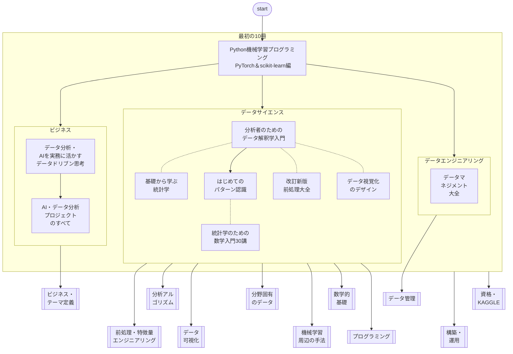
```mermaid
graph TB
    a00([start]) --> a1["Python機械学習プログラミング<br/> PyTorch＆scikit-learn編"]
    subgraph start [最初の10冊]
        direction TB
        a1 ---> bs
        a1 ---> ds
        a1 ---> de
        subgraph bs[ビジネス]
            direction TB
            b1["データ分析・<br/>AIを実務に活かす<br/>データドリブン思考"]
            b2["AI・データ分析<br/>プロジェクト<br/>のすべて"]
            b1 --> b2
        end
        subgraph ds[データサイエンス]
            direction TB
            ds2[分析者のための<br/>データ解釈学入門] -.- ds1[基礎から学ぶ<br/>統計学]
            ds2 --> ds3[はじめての<br/>パターン認識]
            ds3 -.- ds4["統計学のための<br/>数学入門30講"]
            ds2 -.- ds5
            ds2 -.- ds6
            ds5["改訂新版<br/>前処理大全"]
            ds6["データ視覚化<br/>のデザイン"]
        end
        subgraph de[データエンジニアリング]
            de1[データマ<br/>ネジメント<br/>大全]
        end
    end

    bs --> business[["ビジネス・<br/>テーマ定義"]]
    ds ---> prep[["前処理・特徴量<br/>エンジニアリング"]]
    ds --> alg[["分析アル<br/>ゴリズム"]]
    ds ---> vis[["データ<br/>可視化"]]
    ds --> data[["分野固有<br/>のデータ"]]
    ds ---> analy[["機械学習<br/>周辺の手法"]]
    ds --> math[["数学的<br/>基礎"]]
    ds ---> prog[["プログラミング"]]
    de --> dm[["データ管理"]]

    start ---> deploy[["構築・<br/>運用"]]
    start --> cert[["資格・<br/>KAGGLE"]]

```

## 今年の特徴（2023年版からの更新）

::: note info

- 2023年版からの更新
    - カテゴリレベル
        - 新設
            - 「**必須の10冊**」
                - 復活させました。これを読んでおくと「なんもわからん」が減り、「こいつ足腰強いな」感が出るかなと思います
            - 「**生成AI**」
            - 「**Next!**」
                - 直接データ分析の業務には必要ないかもだけど「新規事業考えろ」とか新しいことやらなきゃの人のためのカテゴリを新設しました
        - 削除
            - 「音声処理」「信号処理」「マーケティング」
                - 音声処理、信号処理は私があまり経験なく
                - マーケティングはこれはこれで別記事にしようと
    - 書籍レベル（下記表参照）
        - 前回100冊と言いながら102冊でした（上下巻は1冊、I, IIとあるのは２冊と数えてます）。
        - 20冊削除
            - <details><summary>2023年版より削除した本</summary>

                - 2.2. 前処理・特徴量エンジニアリング
                    - サンプルサイズの決め方
                - 2.3.1. 分析アルゴリズム 統計学
                    - 統計学のセンス
                - 2.3.3. 分析アルゴリズム 機械学習アルゴリズム-2(深層学習)
                    - AI技術の最前線 これからのAIを読み解く先端技術73
                    - 創るためのAI機械と創造性のはてしない物語
                - 2.3.4. 分析アルゴリズム 因果推論
                    - 政策評価のための因果関係の見つけ方 ランダム化比較試験入門
                    - つくりながら学ぶ! Pythonによる因果分析 因果推論因果探索の実践入門
                - 2.3.5. 分析アルゴリズム 異常検知
                    - 異常検知と変化検知
                - 2.3.6. 分析アルゴリズム ネットワーク分析
                    - ネットワーク分析 第2版
                    - ネットワーク科学: ひと・もの・ことの関係性をデータから解き明かす新しいアプローチ
                - 2.3.10. 分析アルゴリズム 評価指標・XAI
                    - 機械学習を解釈する技術〜予測力と説明力を両立する実践テクニック
                - 2.5.4. 画像処理
                    - PyTorch実践入門 ~ ディープラーニングの基礎から実装へ
                - 2.5.5. 地理空間
                    - 空間統計学 自然科学から人文社会科学ま
                - 音声処理（カテゴリごと削除）
                    - Pythonで学ぶ音声認識 機械学習実践シリーズ
                - 信号処理（カテゴリごと削除）
                    - Python対応 ディジタル信号処理
                - 実証分析（カテゴリごと削除）
                    - 進化するビジネスの実証分析
                    - 実証分析入門 データから因果関係を読み解く作法
                - マーケティング（一部「因果推論」に移動、以下は削除）
                    - マーケティングデータ分析
                    - マーケティング・エンジニアリング入門
                    - 需要予測の戦略的活用 ―マーケティングとサプライチェーンマネジメント(SCM)をつなぐ
                    - 推薦システム実践入門 ―仕事で使える導入ガイド

                </details>
        - 24冊追加
        - 4冊改版あり更新
        - Next break 4冊
            - 記事時点で発売前だが本リストに入りそうな候補
    - その他
        - 「レベル感」列は削除
        - 既存書籍でもコメントを更新した箇所あり

:::


|2024年版機械学習・データ分析の100冊+5冊|[2023年版データ分析の100冊](https://qiita.com/aokikenichi/items/29165f719d6e5631d7d0)|更新状況|
|:--|:--|:--|
|1. 必須の10冊|-|カテゴリ新設。他カテゴリ（プロジェクト全体像から2冊、テーマ探索・定義から1冊、データの準備・管理から1冊、前処理・特徴量エンジニアリングから1冊、統計学から1冊、機械学習アルゴリズムから2冊、データ分析のための数学から1冊、可視化から1冊）から移動。1冊更新。差し替え候補1冊|
|2.1. ビジネス・テーマ定義の4冊|1.1. PJ全体像の4冊　1.2. テーマ探索・定義の4冊|カテゴリマージ。一部「必須の10冊」に移動|
|2.2. 前処理・特徴量エンジニアリングの5冊|1.4. 前処理・特徴量エンジニアリングの5冊|1冊削除。「必須の10冊」に1冊移動、1冊更新。2冊追加|
|2.3.1. 分析アルゴリズム 統計学の3冊|1.5. 分析手法 統計学の6冊|1冊削除。「必須の10冊」に2冊移動。差し替え候補1冊|
|2.3.2. 分析アルゴリズム 機械学習アルゴリズム-1の5冊|1.6. 分析手法－アルゴリズム-1の7冊|2冊「必須の10冊」に移動|
|2.3.3. 分析アルゴリズム 機械学習アルゴリズム-2(深層学習)の4冊|1.7. 分析手法－アルゴリズム-2(深層学習)の７冊|2冊削除。1冊「生成AI」に移動|
|2.3.4. 分析アルゴリズム 因果推論・因果探索の6冊|3.1. 因果推論の5冊|2冊削除、2冊追加、1冊「マーケティング」から移動。差し替え候補1冊|
|2.3.5. 分析アルゴリズム 異常検知の2冊|3.2. 異常検知の3冊|1冊削除|
|2.3.6. 分析アルゴリズム ネットワーク分析の1冊|3.3. ネットワーク分析の2冊|2冊削除、1冊追加|
|2.3.7. 分析アルゴリズム スパースモデリングの2冊|3.4. スパースモデリングの2冊|変化なし|
|2.3.8. 分析アルゴリズム 強化学習の2冊|3.5. 強化学習の１冊|1冊追加|
|2.3.9. 分析アルゴリズム ベイズ統計・ベイズ機械学習の4冊|3.6. ベイズ統計・ベイズ機械学習の２冊|2冊追加|
|2.3.10. 分析アルゴリズム 評価指標・XAIの4冊|1.8. 評価指標・XAIの4冊|1冊削除、1冊追加|
|2.4. データ可視化の6冊|1.9. 可視化の６冊|変化なし。差し替え候補1冊|
|2.5.1. 自然言語処理の6冊|2.1. 自然言語処理の5冊|1冊追加|
|2.5.2. 生成AIの6冊|-|カテゴリ新設。1冊「深層学習」から移動かつ更新。5冊追加|
|2.5.3. 時系列分析の7冊|2.2. 時系列分析の5冊|2冊追加|
|2.5.4. 画像処理の1冊|2.3. 画像処理の２冊|1冊削除|
|2.5.5. 地理空間の1冊|2.6. 地理空間の2冊|1冊削除|
|2.6. 機械学習周辺の手法4冊|3.8. 機械学習以外（実験計画法の1冊、数理最適化の2冊、意思決定の数理1冊）|変化なし|
|2.7. 数学的基礎の4冊|4.1 データ分析のための数学(微積・線形代数・集合と位相）の5冊|1冊「最初の10冊」に移動|
|2.8. プログラミングの3冊|4.2. コーディングの３冊|1冊「最初の10冊」に移動。1冊追加|
|3. データ管理の3冊|1.3. データの準備・管理の2冊|1冊追加|
|4.1. 構築・運用の2冊|1.10. 構築・運用の２冊|変化なし|
|4.2. 資格の2冊|5.1. 資格の２冊|1冊更新|
|4.3. KAGGLEの3冊|5.2. KAGGLEの３冊|変化なし|
|5. Next!の5冊|-|カテゴリ新設。5冊追加|
|-|2.4. 音声処理の1冊|カテゴリ削除|
|-|2.5. 信号処理の1冊|カテゴリ削除|
|-|2.7. マーケティングの5冊|カテゴリ削除|
|-|3.7. 実証分析の2冊|カテゴリ削除、1冊「因果推論・因果探索」へ移動|
|計105冊|計102冊||

## 凡例
::: note info
- 書籍紹介での凡例
    - <font color="blue">new</font>
        - 2023年版にはない新たな本を追加。
    - <font color="red">update</font>
        - 同じ本だが改版された。
    - :::note info
        next break
        - 記事時点で発売前だが本リストに入りそうな候補    
- 図の凡例

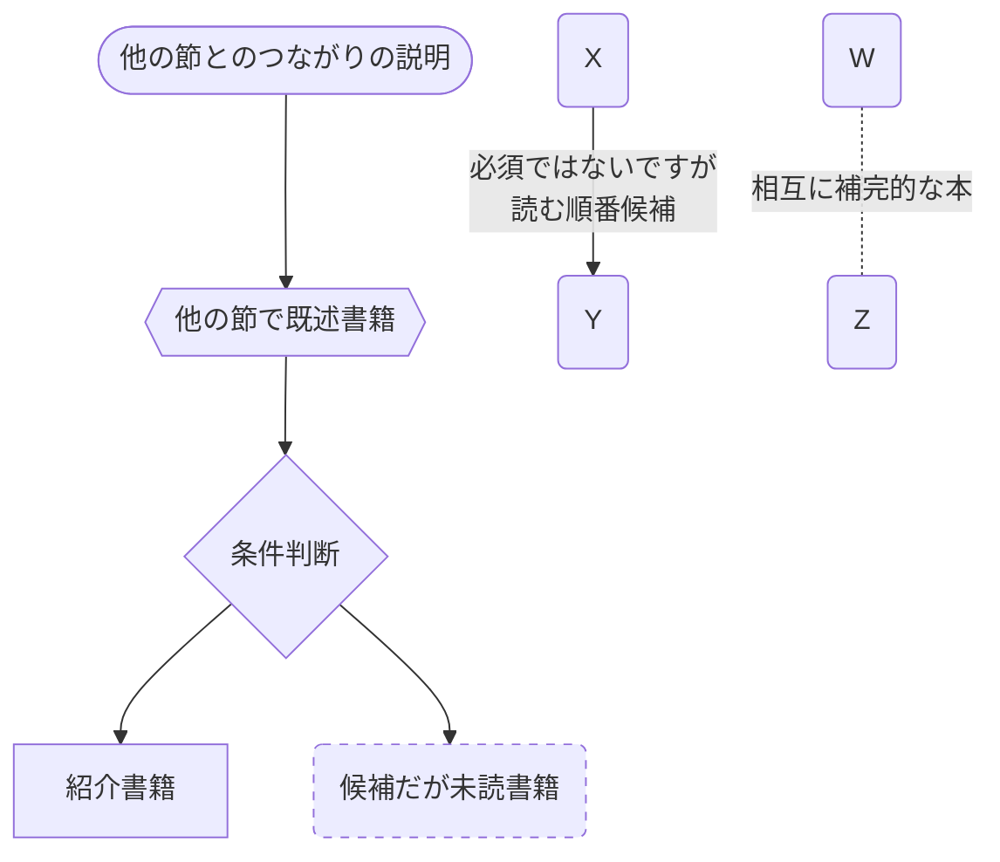
```mermaid
flowchart
    A[紹介書籍]
    B{条件判断}
    C{{他の節で既述書籍}}
    D([他の節とのつながりの説明])
    E(候補だが未読書籍)
    D --> C
    C --> B
    B --> A
    B --> E
    X(X) -->|必須ではないですが<br/>読む順番候補|Y(Y)
    W(W) -.-|相互に補完的な本|Z(Z)

    style E stroke-dasharray: 5 5
```

:::

長いオープニングは終わり、それでは「2024年版機械学習・データ分析の必須10冊+ガチ90冊+Next5冊=105冊」スタートです!


# 1. 必須の10冊
- データサイエンティスト協会の「ビジネス」「データサイエンス」「データエンジニアリング」3つの要素が必要だよ、に合わせてみました
- 冒頭でも述べましたがこの10冊を読んでおくと、「なんもわからん」がかなり減ると思います
- そして、後続の各カテゴリの本へ接続しやすいのかな

|カテゴリ|書名|内容|
|:--|:--|:--|
|最初の1冊|[Python機械学習プログラミング［PyTorch＆scikit-learn編］ (impress top gear)](https://amzn.to/3LXpPhL)<br/><a href="https://amzn.to/3LXpPhL" target="_blank"></a>|<ul><li/><font color="red">update</font>新しい版<li/>私が読んだのはこのシリーズの初版で正直この版は読んでませんが、変わらず評判が良いので挙げました。第3版まで出て202２年に新たにPyTorch & scikit-learn編となっていますが、実質第４版との位置付けつまり最新版とのことで良いと思います。<li/>学び方はいろいろあると思いますが、数式を見てすぐ具体的イメージを掴める人は別として、そうでない方はまずコード写経で、こういうデータを投入してこのライブラリを使うとこういうアウトプットが出るのが〇〇アルゴリズムなんだ、という体で覚えてあとで理論を学ぶ方が早道と思う<li/>なので機械学習の広い分野のコードが載っている本でコード写経が一番だと思っています。<li/>私はRから入ったので『Rによるデータサイエンス』という本ではじめましたが、それが現在の基礎になっています。Pythonで機械学習の本も多数出てますので本書にこだわる必要はなく、伝えたいことは「まずは習う（数学で行き詰まる）より慣れろ（コード写経で機械学習を体験しよう）」です。</ul>|
|ビジネス|[データ分析・AIを実務に活かす データドリブン思考](https://amzn.to/3Ks0ZG8)<br/><a href="https://amzn.to/3Ks0ZG8" target="_blank"></a>|<ul><li/>「AIは目的ではなく手段」ですのに「目的」と押し付けられ困っている方が多いため、反論の理論武装のためにも必須の10冊としました。<li/>実際のビジネスへのデータ分析適用の第一人者と言っていい河本薫氏の本<li/>キーワードは「意思決定」<blockquote>「現場で活用される」とは「現場の意思決定に活用される」ということ。「意思決定に活用される」とは「意思決定プロセスに分析結果が使われる」ということ。そして、意思決定プロセスに分析結果が使われるには、意思決定に有用なデータ分析を行うだけでなく、分析結果が意思決定に活用されるように「意思決定プロセスを設計する」必要があることに気づきました。</blockquote><li/>ここ非常に重要と思う<blockquote>「問題」とは、目標と現状との間いにあるギャップのこと。<br/>「課題」とは、目標と現状とのギャップを埋めるためにやるべきこと、すなわち、「問題」を解消するためにやるべきこと。</blockquote><li/>そしてビジネスで用いられる意思決定を６種類に分類しています<blockquote>A 反復選択型<br/>B 体制選択型<br/>C 原因特定型<br/>D 計画策定型<br/>E 仮説思考型<br/>F 経営判断型</blockquote><li/>このように分析テーマについて非常に論理的にビジネスにデータ分析を適用するということはどういうことかが解説されています</ul>|
|ビジネス|[AI・データ分析プロジェクトのすべて ビジネス力×技術力=価値創出](https://amzn.to/3OeTu6B)<br/><a href="https://www.amazon.co.jp/AI%E3%83%BB%E3%83%87%E3%83%BC%E3%82%BF%E5%88%86%E6%9E%90%E3%83%97%E3%83%AD%E3%82%B8%E3%82%A7%E3%82%AF%E3%83%88%E3%81%AE%E3%81%99%E3%81%B9%E3%81%A6-%E3%83%93%E3%82%B8%E3%83%8D%E3%82%B9%E5%8A%9B%C3%97%E6%8A%80%E8%A1%93%E5%8A%9B-%E4%BE%A1%E5%80%A4%E5%89%B5%E5%87%BA-%E5%A4%A7%E5%9F%8E-%E7%9B%A3%E4%BF%AE%E3%83%BB%E8%91%97%E8%80%85/dp/4297117584?_encoding=UTF8&qid=1690885768&sr=1-1&linkCode=li2&tag=aokikenichi-22&linkId=f21e75802fd860bfe8ef2ddbb388c63f&language=ja_JP&ref_=as_li_ss_il" target="_blank"></a>|<ul><li/>プロジェクト全体像の本ですが「ビジネス」に位置付けました<li/>データ分析プロジェクトの全体像を俯瞰的に解説した本。アルゴリズムがどうのではなくて、体制の組み方、外注の仕方などプロジェクト自体をどう設定してどう動かすのかについて書かれている。<li/>入門として薦める方がいらっしゃいますがこれを読んでしっくり来るかは疑問。ある程度試行錯誤したあとの整理に良い本ではないかと思います。</ul>|
|データサイエンス|[分析者のための データ解釈学入門](https://amzn.to/3YqNQmz)<br/><a href="https://amzn.to/3YqNQmz" target="_blank"></a>|<ul><li/>「私が5年も回り道して学んでいたのは何だったのか！」<li/>ただ、最初にこれだけを読んでも理解が深まるかは分からない。前述の本等で自分で手を動かしていろいろ苦労して疑問が山のように出てから本書を（まー並行してでもいいか）読むと理解が深まると思う。<li/>帯にもありますが「データの取得・分析・解釈・活用の各段階で知っておくべき技術」が分かる。まぁまぁのベテランでも誤解しやすいところも分かる。必読の本。</ul>|
|データサイエンス|[基礎から学ぶ統計学](https://amzn.to/3rRmb1W)<br/><a href="https://amzn.to/3rRmb1W" target="_blank"></a>|<ul><li/>東京大学出版会『統計学入門』を入門に指定されることが多いですが（昔は私もそうしてた）正直統計学の概念は難しく、もっと基礎的なところに絞ってしっかり身につけた方が良いかと。そうなるとこの本。<li/>北大農学部の統計学入門の授業をテキストにまとめたようです。ですので必ずしも数学に馴染みがない学生向けに非常に丁寧にリアルな例とグラフを多用してわかりやすく説明しています。<li/>後述の『データ分析に必須の知識・考え方 統計学入門』の方が範囲が広いのでやや手薄になりがちな基本概念を非常に丁寧に解説しています。「統計学は問題なし」という方でもなければまず本書が良さそうです。</ul>|
|データサイエンス|[はじめてのパターン認識](https://amzn.to/47eDk65) いわゆる**はじパタ本**<br/><a href="https://amzn.to/47eDk65" target="_blank"></a>|<ul><li/>これも類書がたくさん出てきたので他にも良い本があるかもですが（正直私がこれ以外知らんので）、いまだに売れているようで間違いはないと思う。<li/>本書が理論入門の定番とされている、と思う。深層学習については言及がないが、機械学習で用いられる手法についてほぼ網羅されている。後掲PRMLを勧める方が多いが、研究者でもない限りいきなり読んでも挫折すると思うのでまずは本書からが良いと思う。<li/>ディープラーニングについては書いてませんが、まずは基本を押さえるということで。ディープラーニングについては本書のディープラーニング編もあるようですが、類書がたくさんありますね（後述）。</ul>|
|データサイエンス|[統計学のための数学入門30講](https://amzn.to/3DKfbXs)<br/><a href="https://amzn.to/3DKfbXs" target="_blank"></a>|<ul><li/>とは言うものの数学が必須だよね。大学で学んだから代替だいたいは分かるのだけど統計との関連が今ひとつ、、、ってな方に適しています。統計学でどのように使われているかを念頭に置いた、微分積分、線形代数の紹介。1冊で紹介しているので各内容の説明は薄め。<li/>最近は「機械学習のための数学」のような本が増えているのでそちらでも良いかもですが、流行りにのったやっつけ本？というようなちょっと不安な本もありますが、本書は数学入門書を多数書かれている先生の本で安心。<li/>一通り勉強した後の確認や、過去に勉強したが錆び付いている人の再起動、今学んでいることを統計学と結び付けたい人向け。<li/>講談社機械学習プロフェッショナルシリーズ『深層学習』の読み解きをした時に、数学でわからないところはほぼ本書に出ていました。<li/>ただ、薄い本書に微分積分と線形代数を押し込めているので、初学者には厳しいと思います。微分積分と線形代数の入門書は鬼のようにたくさん出ているので、大学での微分積分、線形代数なんてまるでわからんって方は本書の前に、マセマなど大学1年生用の簡単な本から。</ul>|これなら分かる最適化数学―基礎原理から計算手法まで|
|データサイエンス|[改訂新版 前処理大全](https://amzn.to/3AlqCX4)<br/><a href="https://amzn.to/3AlqCX4" target="_blank"></a>|<ul><li/><font color="red">update</font>新しい版に。（残念だが当然か）Rが消えてPolarsが入ったのですね。<li/>実業務ではデータの汚さと格闘することになります。<li/>データ分析の8割は前処理、などと言われる割にはまとまった解説書がないところに前の版が出てその後類書が増えましたけれど分かりやすさ、網羅性でやはり本書ですね。<li/>データの集計・結合・分割・生成などの整形の大全。1つの課題に対し、SQL、Python /Pandas系、Python/Polars系の3言語（ライブラリ）でどう対処するかのコード例、また言語による得手不得手の明示。<li/>ググればたいてい見つかるものだけど、思い込みで局所解に陥っていたら効率の悪いコードにハマっているかも。一度正解を眺めておくだけでも前処理の深みにハマることを避けられると思う。</ul>|
|データサイエンス|[データ視覚化のデザイン](https://amzn.to/3DIS6UZ)<br/><a href="https://amzn.to/3DIS6UZ" target="_blank"></a>|<ul><li/>著者はTableauのコンサルティングがご専門のようですが広くデータ分析での可視化にもそのまま適用できる本かと思います。データ分析に詳しくないユーザーや顧客に分析結果をどう提示するかに悩んでいる方には必読と思います。<li/>作図をしているとついつい情報を詰め込みがちになるのは誰しも経験のあるところではないでしょうか。本書にある「詰め込むな削れ」は痛いところを突かれたと思う方も多いのではないでしょうか。<li/>通常のデータ分析での可視化の本はライブラリの使い方がメインですがそもそもどういう伝え方をしたいのかで図が決まりますがそこを解説している本は少ないです。目次も、魅せ方を意識した内容です。<blockquote>第1章 データ視覚化「キモのキモ」<br/>第2章 これだけでグッとプロっぽくなるコツ<br/>第3章 目的に応じたチャートの選択<br/>第4章 事例で学ぶーダッシュボード作成過程思考キャプションー<br/>第5章 本当に組織に根付かせるために</blockquote></ul>|
|データエンジニアリング|[データマネジメント大全](https://amzn.to/47n2LlI)<br/><a href="https://amzn.to/47n2LlI" target="_blank"></a>|<ul><li/>データエンジニアよりももうちょっと俯瞰にその組織のデータ管理のあり方のような本です。<li/>分析者の環境により、何かGUIツールがあるのかSQLをガシガシ書くような環境か、データエンジニアが別にいるのか全部自分でやるのか、によりますがデータマネジメントの基本は知っておいたほうが良いですね。<li/>下記目次のとおり、データ分析ではなくデータ活用のためにどうデータを管理するかの本です<li/>機械学習の教科書だとわかりやすいデータが用意されていて、これで分類しましょう、とかとなりますが、現実の問題では、あると言われたデータがない、言われたのとは全然違うフォーマット、担当者が独自のExcelでバラバラに持っている、ID体系が異なり突き合わせができない、A部署にあると言われたがA部署からNoと言われもらえない等々が発生します<li/>そうならないために、それを解決するためにどうするかという本です<blockquote>第1章　DXの正しい歩み方<br/>第2章　DX推進の鍵を握るデータドリブン経営<br/>第3章　データドリブン経営の成敗を左右するデータ利活用<br/>第4章　データ利活用を支えるデータマネジメントの全体像<br/>第5章　データマネジメント 戦略層<br/>第6章　データマネジメント 実行層<br/>第7章　データマネジメント 組織とヒト層</blockquote></ul>|

:::note info
next break
- [妥協しないデータ分析のための 微積分+線形代数入門](https://amzn.to/4cm8nxS) 9/21発売予定
    - <a href="https://amzn.to/4cm8nxS" target="_blank"></a>
    - 9/21が待ち遠しく当然ながら未読ですが、好著連発のソシムのカラフルシリーズ
    - そして目次を見てよ、ちゃんと勉強している人ならわかるはず。「そこを知りたかった」が書いてある。『統計学のための数学入門30講』と差し替えになるかも。期待大！

        <details><summary>目次</summary>
        
        ```
        【第1部　線形代数の基礎】
        第1章　ベクトルと内積
         ベクトルはデータ・数値、内積は係数付き和・類似度
        第2章　行列とその積
         行列はデータ・パラメーター・量を表し、変換・関係に使う
        
        【第2部　微分積分の基礎】
        第3章　微分
         微分は変化の倍率・変換である
        第4章　微分の技術
         変化の倍率で理解する微分の諸公式
        第5章　関数の最大・最小
         データ分析のあらゆる場面で活用される基礎問題
        第6章　積分
         関数の値の総和を計算する技術
        
        【第3部　微分積分とデータ分析】
        第7章　数式を読み解くコツ
         しっかりした基礎を構築しておく
        第8章　最適化手法と深層学習
         最適化問題への微分の応用
        第9章　Lagrange の未定乗数法
         制約付き最適化問題への処方箋
        第10章　正規分布とエントロピー
         連続的な確率変数の扱い

        【第4部　線形代数とデータ分析】
        第11章　逆行列と対角化
         線形変換を新しい角度から理解するツールたち
        第12章　対称行列の対角化
         行列で関係を表現し、対角化で関係を分解する
        第13章　分散共分散行列と主成分分析
         分散共分散行列の対角化は分散共分散関係の分解
        第14章　特異値分解
         別種の対象の取り扱いとその分解について
        第15章　正準相関分析と特異値分解
         関係の分解による変数群間の関係の把握
        第16章　特異値と深層学習
         勾配消失・爆発とランダム行列の積
        第17章　意味表現空間としての高次元線形空間と内積
         AIを支える高次元線形空間
        
        【第5部　微分積分と線形代数を活用したデータ分析】
        第18章　回帰分析と擬似逆行列
         2種の逆がもたらす代数的理解と幾何的理解
        第19章　多変量正規分布とその積分
         多変数の確率分布の構造と特性
        第20章　生成モデルと変分自由エネルギー
         本来は不可能な学習を可能にした技術
        ```
        </details>

:::

# ビジネス
- データサイエンティストにもビジネス、ドメイン知識は必要だよとよく言われるところですね
- ドメイン知識は個々によると思いますので、別に書いているnote記事[業界ごとのAI・データ分析参考書籍](https://note.com/aokikenichi/n/n36252eed4357)をご参照ください

https://note.com/aokikenichi/n/n36252eed4357

- ここでは、データ分析は目的じゃなく手段、ビジネスメリットを出すにはどうしたらいいかの本を紹介しています

## 2.1. ビジネス・テーマ定義の3冊
- そもそも何を目指しているのの「戦略」
- PJの進め方や組織のあり方などです

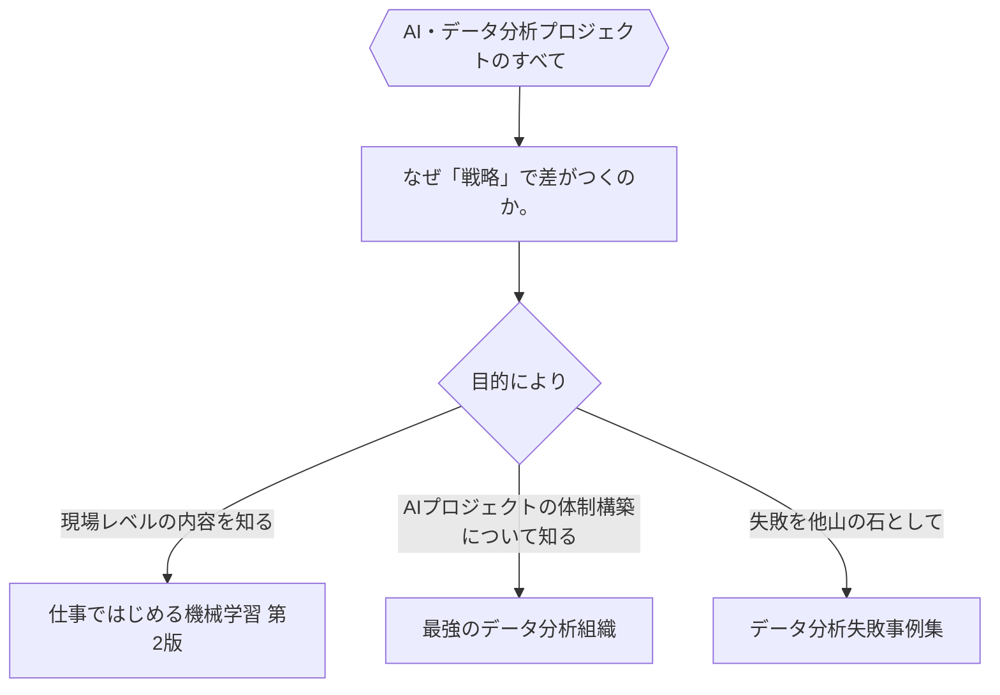
```mermaid
flowchart
    id0{{AI・データ分析プロジェクトのすべて}} --> id1["なぜ「戦略」で差がつくのか。"]
    id1 --> id2{目的により}
    id2 -->|現場レベルの内容を知る|id3[仕事ではじめる機械学習 第2版]
    id2 -->|AIプロジェクトの体制構築について知る|id4[最強のデータ分析組織]
    id2 -->|失敗を他山の石として|id5[データ分析失敗事例集]
```

|書名|内容|
|:--|:--|
|[なぜ「戦略」で差がつくのか。](https://amzn.to/3qiJnWr)<br/><a href="https://amzn.to/3qiJnWr" target="_blank"></a>|<ul><li/>本書は機械学習やデータ分析の本ではありません。ただ、目的と手段を誤った「AIでなんかやれ」もまだまだ多数見受けられます。そもそも我が社、お客様は何をしたいのかを考える必要があるでしょう。<li/>そもそもデータ分析が必要なのか、そのデータ分析プロジェクトで何をしたいのか、リソース制約は何か、整理することが求められます。本書は関係者の共通理解を得るための第一歩になると思います。<li/>戦略についてどうこう議論している本は数多あるものの、「戦略」とは何かをきちんと定義しいる本はまず見ないです。みんな「戦略」を定義しないまま好き勝手に言ってませんか。<li/>「戦略」と口にする人ほど、戦略的に捨てた選択肢を、「とは言ってもこの観点もあの観点も必要だやってないのか」と蒸し返します。<li/>マーケター向けの本であり、本ブログ著作青木もマーケティング関連の勉強として読みましたがかなりの衝撃を受けました。マーケティングのみでなくおよそビジネスで「戦略」という言葉が出てくる分野には全て通用する話です。<li/>皆簡単に「戦略」という言葉を使い共通理解がないまま破綻していませんか。<li/>Amazon紹介ページにある通り、ほとんどの会社が無自覚に「戦略」という言葉を使っていると思います。<blockquote>しかし、経営戦略、マーケティング戦略、広告戦略、営業戦略…<br/>と企業の中では「戦略」という言葉が必要以上に多用されています。定義や意味が曖昧なため、ビジネスの現場で混乱や誤解を招く原因にもなり、実際的に戦略を運用する上では、ほとんど役に立ちません。<br/>つまり「戦略」は、いまだにかなり曖昧な単語だということです。戦略の考え方のひとつを理解することは、今後の選択や意思決定に対して有効な指針となります。本書は、それぞれの読者が戦略を実践的な思考の道具として体得されることを目指すものです。</blockquote><li/>本ブログ著者の青木は「戦略においては、限られたリソースのもと目的達成のために何を実施し、何を捨てるか、の『何を捨てる』の共通理解を得ることが一番大事」と本書を理解しています。</ul>|
|[仕事ではじめる機械学習 第2版](https://amzn.to/3QsK9Lh)<br/><a href="https://amzn.to/3QsK9Lh" target="_blank"></a>|<ul><li/>AIのPJ全体について『AI・データ分析プロジェクトのすべて』で知ったあと、現場レベルにより絞った具体の内容として読むといいのではないか。 <li/>下記目次で示されるとおり、「仕事で使う」という軸で機械学習に必要な項目を概説している<blockquote>1章　機械学習プロジェクトのはじめ方<br/>2章　機械学習で何ができる？<br/>3章　学習結果を評価するには<br/>4章　システムに機械学習を組み込む<br/>5章　学習のためのリソースを収集する<br/>6章　継続的トレーニングをするための機械学習基盤<br/>7章　効果検証：機械学習にもとづいた施策の成果を判断する<br/>8章　機械学習のモデルを解釈する<br/>第II部<br/>9章　Kickstarterの分析、機械学習を使わないという選択肢<br/>10章　Uplift Modelingによるマーケティング資源の効率化<br/>11章　バンディットアルゴリズムによる強化学習入門<br/>12章　オンライン広告における機械学習</blockquote></ul>|
|[最強のデータ分析組織](https://amzn.to/43ZVJR0)<br/><a href="https://amzn.to/43ZVJR0" target="_blank"></a>|<ul><li/>同じく河本薫氏の本<li/>氏が元大阪ガス時代に苦労して作り上げたデータ分析チームについて<li/>これも、何もわかってない人がどこかの記事を聞きかじって茶々入れて時間ばかり食うので、理論武装しておこう。</ul>|
|[データ分析失敗事例集: 失敗から学び、成功を手にする](https://amzn.to/3DOhrwV)<br/><a href="https://amzn.to/3DOhrwV" target="_blank"></a>|<ul><li/>本当に本書に書いてる通りに失敗するよ！「AIは分からないからお前に任せた」という人が、機械学習と深層学習の違いも分からないのに「ディープラーニングなら出来るはずだ！」とか割り込んで来て大変。<li/>失敗しないために、失敗を知っておこう。<li/>データ分析PJを多数実践してきた方ならば目次だけで泣けるだろうし、これからの方は次に迫る失敗を乗り越えるために要注意な点が満載<blockquote>Part Ⅰ　「えーあい」でなんとかして！<br/>CASE 1　ＵＩを統一してＵＸが破綻する　<br/>CASE 2　誰のための仕事？ それが問題だ　<br/>CASE 3　最先端アピールのための最先端プロジェクト　<br/>CASE 4　本当に季節性はありますか　<br/>CASE 5　レコメンドの必要ありますか　<br/>CASE 6　分析を現場でどう使うか　<br/>CASE 7　ほとんど故障しない製品の故障予知　<br/>CASE 8　ＡＩという言葉の曖昧さ　<br/>CASE 9　そんな目的変数で大丈夫か　<br/>コラム　データサイエンティストとしての生き方　<br/>Part Ⅱ　翻弄されるデータサイエンティスト<br/>CASE 10　成功した報告しか聞きたくない　<br/>CASE 11　ターゲティングの必要性　<br/>CASE 12　決定木分析は決定木だけではない　<br/>CASE 13　ドメイン知識の重要性　<br/>CASE 14　政治的な数字の応酬　<br/>CASE 15　プロダクトアウトでもドメイン知識は大事　<br/>CASE 16　スタイルの違いが引き起こした混乱　<br/>CASE 17　いくら分析したところで、売れないものは売れない　<br/>コラム　データサイエンティストの人事事情　<br/>Part Ⅲ　その失敗を超えてゆけ<br/>CASE 18　カオス状態のＢＩレポート　<br/>CASE 19　用意できたのは集計データのみ。予測精度はどこまで……　<br/>CASE 20　取ってびっくり、こんなに使えるデータは少ないのか　<br/>CASE 21　頑張って予測していたのは……　<br/>CASE 22　木を見て森を見ずはキケン　<br/>CASE 23　総人口の十倍を超えるＩＤ数との出会い　<br/>CASE 24　最終報告が終わってから集計の仕様が決まる　<br/>CASE 25　機械学習モジュールの寿命　<br/>コラム　絶対に失敗しないデータ分析</blockquote></ul>|


## 2.2. 前処理・特徴量エンジニアリングの5冊
- 続いて、データが用意されたとして、機械学習アルゴリズムは結構グルメです。美味しい（分類・回帰等に適した）データでないと臍を曲げてまともな結果を返してくれません
- データを食べられるようにするにはどうしたら良いかの前処理と、より美味しくするためにはどうしたら良いかの特徴量エンジニアリングは重要です
- 『サンプルサイズの決め方』は良書ですが、難しく、データで殴る系の機械学習メインならば『入門 サンプルサイズ設計』で確実に基礎をおさえる方が良いと思い、外しました

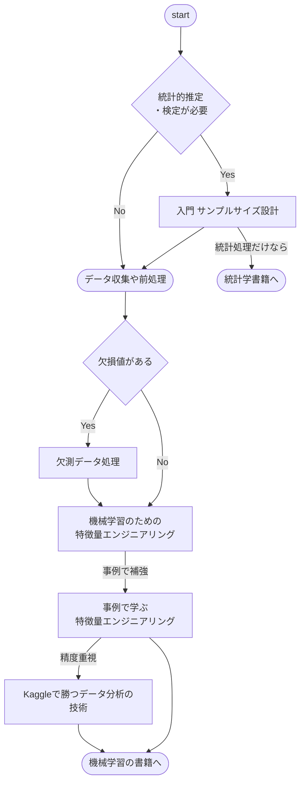
```mermaid
flowchart TD
    id0([start]) --> id1{統計的推定<br/>・検定が必要}
    id1 -->|Yes|id2[入門 サンプルサイズ設計] --> id3
    id2 -->|統計処理だけなら|id10([統計学書籍へ])
    id1 -->|No|id3([データ収集や前処理])
    id3 --> id4{欠損値がある}
    id4 -->|Yes|id5[欠測データ処理]
    id4 -->|No|id6[機械学習のための<br/>特徴量エンジニアリング]
    id5 --> id6
    id6 -->|事例で補強|id7[事例で学ぶ<br/>特徴量エンジニアリング]
    id7 -->|精度重視|id8[Kaggleで勝つデータ分析の技術]
    id7 & id8 --> id11([機械学習の書籍へ])
```


|書名|概要|
|:--|:--|
|[入門 サンプルサイズ設計](https://amzn.to/4dQNFHT)<br/><a href="https://amzn.to/4dQNFHT" target="_blank"></a>|<ul><li/><font color="blue">new</font>新規追加<li/>本書のまえがきに、『サンプルサイズの決め方』の前段階の入門書の旨の説明があります。<li/>Rを用いて下記の説明があります。<li/>１標本・２標本について平均値、割合、感度・特異度の検定<li/>１標本の平均値・割合、２標本の平均値・割合の差の信頼区間<li/>シミュレーションによるサンプルサイズ設計<li/>『サンプルサイズの決め方』も良い本ですがやはり難しい面があり、食わず嫌いをするよりも優しい本書せしっかり基礎固めをした方が良いかなと今回差し替えました。</ul>|
|[欠測データ処理: Rによる単一代入法と多重代入法](https://amzn.to/3QzQBQB)<br/><a href="https://amzn.to/3QzQBQB" target="_blank"></a>|<ul><li/>Rでの本ですがPythonでの本で適当なものがなく、要点は言語関係ないので取り上げました<li/>欠測値の扱いはこれからどんどん高まるはず。<li/>機械学習アルゴリズムによっては欠測値は特に処理しないでそのまま扱えることも多いけど、そうでない場合もある。そんなとき欠測値は厄介なのでみんな適当に処理しがち。<li/>結構しっかりした統計の本でも「欠測値があるデータは除くこと」、「平均で埋める」などとしていることが多いが、むやみにデータを除くと分散などが歪む、適切な値で埋めないと分散が小さくなる、正しく埋める方法がある<li/>ことをRコードを示しながら丁寧に解説している。日本の統計の杜撰さが話題になってますが意図して、せずに関わらずビジネスのデータは欠損が多い。今後非常に重要になってくるはずです。今のうちに学ぼう。</ul>|
|[機械学習のための特徴量エンジニアリング](https://amzn.to/45l6mzs)<br/><a href="https://amzn.to/45l6mzs" target="_blank"></a>|<ul><li/>機械学習モデルにそのままデータを投入すればよいわけではなく特徴量のうまい調理方法がありそれは特徴量エンジニアリングと呼ばれる<li/>『前処理大全』『Kaggleで勝つデータ分析の技術』にも一部言及があるが本書は特徴量エンジニアリングに特化した本。<li/>数値データの対数化等の加工、自然言語処理でのBoW、カテゴリデータの扱い、次元削減、k-means、深層学習での画像特徴量の抽出など基本だが重要な概念をコード例付きで詳しく解説している。</ul>|
|[事例で学ぶ特徴量エンジニアリング](https://amzn.to/4dyLw3T)<br/><a href="https://amzn.to/4dyLw3T" target="_blank"></a>|<ul><li/><font color="blue">new</font>新規追加<li/>特徴量エンジニアリングの基礎のおさらいと、COVID-19データによる欠損値補完など、バイアス・公平性、自然言語処理の特徴量、画像処理、時系列データ、特徴量ストアまでを事例に基づいて紹介。<li/>ほら、特徴量エンジニアリングって理屈の基礎的なところは、ふむふむ、となりますがいざ実際のテーマ・データを対峙すると「あれ、どうすんだっけ？」ってなりますよね。そこをつなぐ・うめるような本かな。<li/>翻訳者さんが本書の解説しているQiita記事[改めて「特徴量エンジニアリング」とは何か？](https://qiita.com/tamura__246/items/59b2475972a60ba1d65b)もわかりやすいからこれだけでも読んで。</ul>|
|[Kaggleで勝つデータ分析の技術](https://amzn.to/3DH6PQk)<br/><a href="https://amzn.to/3DH6PQk" target="_blank"></a>|<ul><li/>Kaggle本ですが、Kaggleのためであれば新しい本が出ており、本書は古くなっています。本書はKaggle向けだけではなくデータ分析に必要な特徴量エンジニアリングを含めて基本的なノウハウを網羅しているので、あえてこちらに入れました。<li/>爆売れしているらしい。そら売れるだろう。キャッチーな「Kaggleで勝つ」に加えて内容がいいもの。<li/>Kaggle名人（Masterなど）がドヤ顔せず丁寧に手の内を明かしてくれている。<li/>データの前処理、アルゴリズム選定、パラメータ設定等あるいみすべて。<li/>Kaggleで勝つための小細工もあるが、Kaggleなんてする気ねぇという気質の分析者にも実務で得るところ多いはず。<li/>いやーこんなのが日本語で数千円で読めるなんてすごい時代になったなー昔なんて洋書か大部な数式だらけの本しかなかったんだぜ。</ul>|


## 2.3. 分析アルゴリズム
### 2.3.1. 統計学の3冊
- 統計学が入門で機械学習がその応用としているような解説をまま見ますが違います
- TJOさんの記事[「統計学と機械学習の違い」はどう論じたら良いのか](https://tjo.hatenablog.com/entry/2015/09/17/190000)に詳しいですが、
    >統計学はデータを「説明」することにより重きを置く
    >(中略)
    >機械学習はデータから「予測」することにより重きを置く
    >（中略）
    >とは言え、統計学と機械学習の違いは基本的にはそれほど大きくないし互いに重なる部分だらけ
- ということで機械学習の前提知識や基礎という意味ではなく、別の面から見る、という意味で統計学を身につけるものかと思います

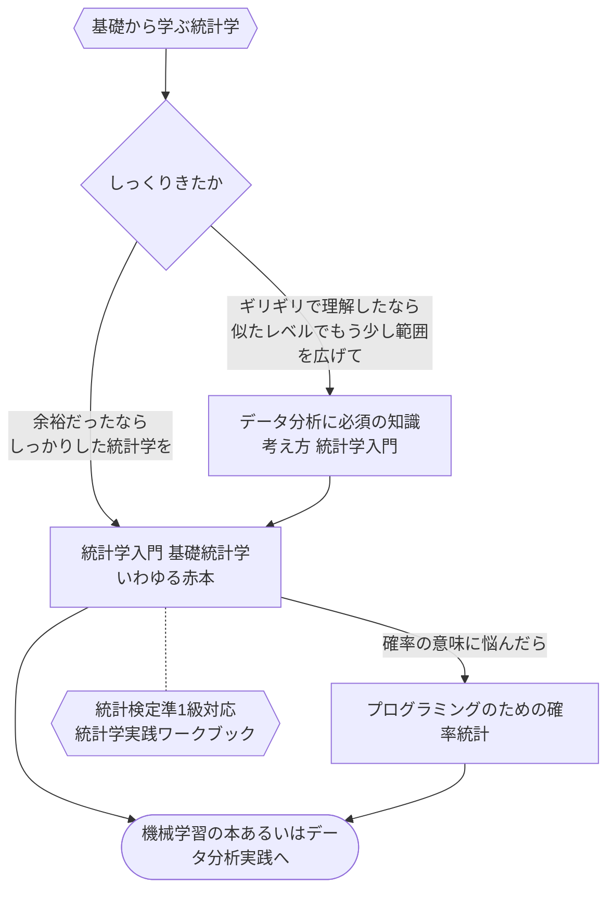
```mermaid
flowchart TD
    id0{{基礎から学ぶ統計学}} --> id1{しっくりきたか}
    id1 -->|ギリギリで理解したなら<br/>似たレベルでもう少し範囲を広げて|id2[データ分析に必須の知識<br/>考え方 統計学入門]
    id1 -->|余裕だったなら<br/>しっかりした統計学を|id3[統計学入門 基礎統計学<br/>いわゆる赤本]
    id3 -->|確率の意味に悩んだら|id4[プログラミングのための確率統計]
    id2 --> id3
    id3 --> id6([機械学習の本あるいはデータ分析実践へ])
    id4 --> id6
    id3 -.- id7{{統計検定準1級対応<br/>統計学実践ワークブック}}
```

|書名|概要|
|:--|:--|
|[データ分析に必須の知識・考え方 統計学入門](https://amzn.to/45mJ9MY)<br/><a href="https://amzn.to/45mJ9MY" target="_blank"></a>|<ul><li/>必読。私は苦労して学んだのに今の人は本書から入れてずるいって感じ<li/>統計学とデータ分析はかなりかぶるのですが、少ないデータをどう扱うかの理論武装をしている面がある統計学とデータ量で力任せな機械学習と味方が異なる面があります。<li/>なので統計学の本で機械学習にはあまり要らないなーという項目もあるのですが、本書はサブタイトルに「データ分析に必須の知識・考え方」とあり、必要な点に絞りかつ統計学の入門書ではあまり扱わない項目（統計モデリング、数理モデリング、機械学習の基礎等）も含まれています<ul><li/>統計分析の目的は何ですか？<li/>p値の意味を理解していますか？<li/>相関と因果を区別できていますか？<li/>その結果に再現性がありますか？</ul><li/>数式は最小限でイラストを多用して本質について解説してくれています。</ul>|
|[統計学入門 (基礎統計学)](https://amzn.to/3rUfGvf)**いわゆる「赤本」**<br/><a href="https://amzn.to/3rUfGvf" target="_blank"></a>|<ul><li/>本書が理論理解入門の定番とされてますが、やや難しいです。ただ、分からない概念が出てきたときに本書に戻ると解説されていることが多いです。<li/>ググれば分かりますし、統計学入門なら別の本がたくさんありますが、「これが共通言語」という意味では手元に置いておいたほうがよいと思います。</ul>|
|[プログラミングのための確率統計](https://amzn.to/3YlfQbp)<br/><a href="https://amzn.to/3YlfQbp" target="_blank"></a>|<ul><li/>確率・統計の「意味」が分かる。題名の「プログラミング」はほぼ関係ない。簡単にだが「カルマンフィルタ」なども紹介されている。<li/>確率は面積だ！</ul>|

:::note info
next break
- [公式と例題で学ぶ統計学入門](https://amzn.to/3XjftyU) 8/17←もう出たねだがまだ読んでないすまん<br/>
<a href="https://amzn.to/3XjftyU" target="_blank"></a>
    - 赤本と差し替えになるか？
:::

### 2.3.2. 機械学習アルゴリズム-1の5冊
- みんな大好きデータ分析のアルゴリズムにやっと辿り着きました
- ここで「数学がー」と騒がれるのですが、私は断然コード写経派です。研究者ならば数式をがっつり理解しないといけませんが、データ分析の技術者であればまずはコード写経でなれることが王道だし、早道と思います
- もちろん理論を知っている方が応用が効きますが、コード写経で、このデータをこのライブラリでこのハイパーパラメータで扱うとこういう結果が出るのだな、と知った上での方が数式の意味も入りやすいです
    - もちろん理論書の式展開や章末問題をきちんと解くということまですれば差別化につながりますが


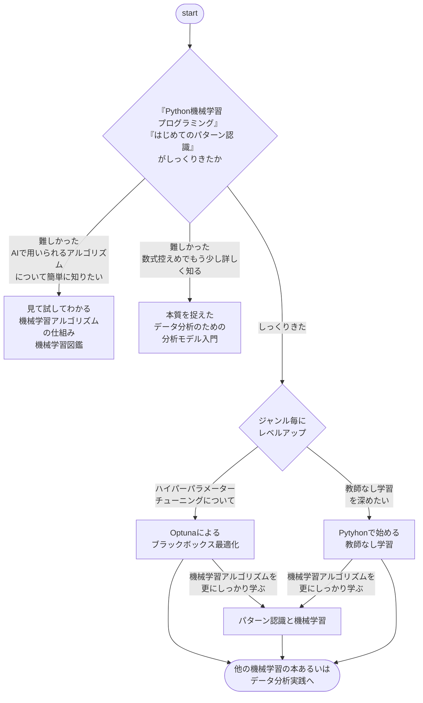
```mermaid
flowchart TD
    id0([start]) --> id1{『Python機械学習<br/>プログラミング』<br/>『はじめてのパターン認識』<br/>がしっくりきたか}
    id1 -->|難しかった<br/>AIで用いられるアルゴリズム<br/>について簡単に知りたい|id2[見て試してわかる<br/>機械学習アルゴリズム<br/>の仕組み<br/>機械学習図鑑]
    id1 -->|難しかった<br/>数式控えめでもう少し詳しく知る|id3[本質を捉えた<br/>データ分析のための<br/>分析モデル入門]
    id1 --->|しっくりきた|id4{ジャンル毎に<br/>レベルアップ}
    id4 -->|ハイパーパラメーター<br/>チューニングについて|id5[Optunaによる<br/>ブラックボックス最適化]
    id4 -->|教師なし学習<br/>を深めたい|id6[Pytyhonで始める<br/>教師なし学習]
    id5 --> id9    
    id5 -->|機械学習アルゴリズムを<br/>更にしっかり学ぶ|id8[パターン認識と機械学習]
    id6 -->|機械学習アルゴリズムを<br/>更にしっかり学ぶ|id8
    id6 --> id9
    id8 --> id9([他の機械学習の本あるいはデータ分析実践へ])

```

|書名|概要|
|:--|:--|
|[見て試してわかる機械学習アルゴリズムの仕組み 機械学習図鑑](https://amzn.to/3OAfwSG)<br/><a href="https://amzn.to/3OAfwSG"></a>|<ul><li/>「このくらいわかってるよ」という方もいらっしゃると思いますが、LSA, NMF, LDA, LLEとかちゃんと説明できますか。<li/>『データ分析のための数理モデル入門』、『分析者のためのデータ解釈学入門』なども出たので図解でわかりやすい唯一の本、という価値は薄れたかもしれないですけど、基本概念を図解でどう示したらいいか、という観点なら本書が一番かと。提案書やレポートでアルゴリズムなどを顧客に説明しなけらばならない時など参考になると思います。</ul>|
|[本質を捉えたデータ分析のための 分析モデル入門](https://amzn.to/3s13rgI)<br/><a href="https://amzn.to/3s13rgI" target="_blank"></a>|<ul><li/>機械学習アルゴリズムを知るには数学が必要ですが難しく、数式の海に溺れがちです<li/>回帰分析、ロジスティック回帰など基礎的なところから、教師あり学習、教師なし学習、強化学習、深層学習、画像処理、自然言語処理など非常に幅広く、その本質を数式とともにイラストで分かりやすく示してくれています。</ul>|
|[Pytyhonで始める教師なし学習](https://amzn.to/443EaQm)<br/><a href="https://amzn.to/443EaQm" target="_blank"></a>|<ul><li/>教師あり学習が主で、教師なし学習は添え物的に扱われがちですが、実際のビジネスにおいてはデータがないことがかなりある。<li/>次元削減、異常検出、クラスタリングから深層学習を用いた手法、時系列クラスタリングまで、教師なし学習の代表的な手法をコード付きで丁寧に解説している。</ul>|
|[Optunaによるブラックボックス最適化](https://amzn.to/3DL4F21)<br/><a href="https://amzn.to/3DL4F21" target="_blank"></a>|<ul><li/>機械学習アルゴリズムのハイパーパラメーターの最適化を行うOptunaについて開発者らの解説本<li/>機械学習アルゴリズム本の一節に簡単に取り上げられることが多いですが1冊丸ごとでの解説本。</ul>|
|[パターン認識と機械学習 上](https://amzn.to/3OIJwMq)<br/>[パターン認識と機械学習 下](https://amzn.to/3Qv8TTi)<br/>いわゆる**PRML**<br/><a href="" target="_blank"></a> <a href="" target="_blank"></a>|<ul><li/>ベイズの立場から機械学習アルゴリズムを解説した定番書<li/>これも類書がたくさん出てきているので別に良い本があるかも（ごめん、このレベルの本はこれしか読んでないので。<li/>でもむずいので手引きとして前提知識を解説した [『パターン認識と機械学習の学習 普及版』](https://herumi.github.io/prml/) なんてのもあるよ</ul>|

### 2.3.3. 機械学習アルゴリズム-2(深層学習)の4冊
- ここ更新ないのすまん「生成AI」を別立てにして新しい本を追加したので許してくだされ
    - 何でもかんでもはできないので、深層学習については本記事著者青木は最低限だけで避けてきたのだけれどLLMの大波で改めて勉強している
- 深層学習はあまり実装したことないので実装系の本が入ってないのはご容赦
    - 画像処理、自然言語処理の項にて

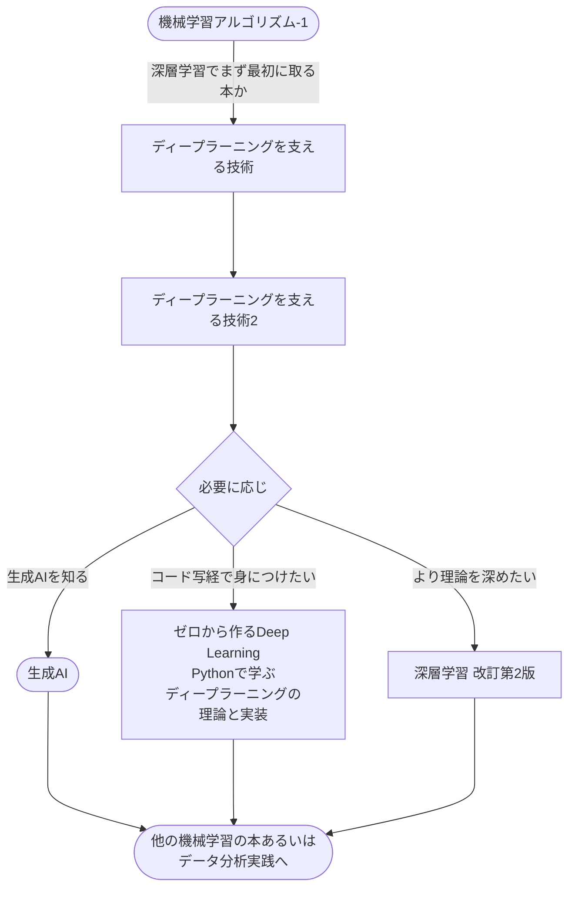
```mermaid
flowchart TD
    id0([機械学習アルゴリズム-1])-->|深層学習でまず最初に取る本か|id1[ディープラーニングを支える技術]
    id1 ---> id2[ディープラーニングを支える技術2]
    id2 ---> id3{必要に応じ}
    id3 -->|コード写経で身につけたい|id4[ゼロから作るDeep Learning<br/>Pythonで学ぶ<br/>ディープラーニングの<br/>理論と実装]
    id3 -- 生成AIを知る --> id8([生成AI])
    id8 ---> id7

    id3 -- より理論を深めたい --> id5[深層学習 改訂第2版]
    id7([他の機械学習の本あるいはデータ分析実践へ])
    id4 ---> id7
    id5 ---> id7

```

|書名|概要|
|:--|:--|
|[ディープラーニングを支える技術](https://amzn.to/3DLcJju)<br/><a href="https://amzn.to/3DLcJju" target="_blank"></a>|<ul><li/>類書がたくさんありますが難しいか端折っていて要点がわからないか<li/>本書は第一人者のPFN岡野原氏の著者であり、要点を外さない解説</ul>|
|[ディープラーニングを支える技術２](https://amzn.to/3KprDQg)<br/><a href="https://amzn.to/3KprDQg" target="_blank"></a>|<ul><li/>本書は前著に続き「生成モデル」「深層強化学習」について解説している</ul>|
|[ゼロから作るDeep Learning ―Pythonで学ぶディープラーニングの理論と実装](https://amzn.to/3YptwSH)<br/><a href="https://amzn.to/3YptwSH" target="_blank"></a>|<ul><li/>ライブラリを用いたコーディング事例ではなく、ディープニューラルネットワーク自体をほぼスクラッチで書こうという本<li/>ディープラーニングよりもその基礎のニューラルネットワークの解説が中心。<li/>数式の本が難しく、フレームワークでなぞるだけでは物足りない方が、原理をしっかり理解したい場合の導入としてちょうどよい本と思う。</ul>|
|[深層学習　改訂第２版](https://amzn.to/3QywwdH)<br/><a href="https://amzn.to/3QywwdH" target="_blank"></a>|<ul><li/>本記事著者青木は本書の第一版を数式を解きおこしながら読んでだいぶ助けられました。<ul><li/>[講談社機械学習プロフェッショナルシリーズ『深層学習』の学習 第1章 はじめに、第2章 順伝播型ネットワークの学習](https://qiita.com/aokikenichi/items/eead6f7b7fad1f33056e) から８章まで</ul><li/>第二版は大幅増量し走り読み程度しかまだできてませんが。<li/>骨格のところを丁寧に記述しているので、深層学習を扱うならば一度時間をかけて数式を追って読み通すのがブレない土台をしっかりさせる近道と思います</ul>|


### 2.3.4. 因果推論・因果探索の6冊
- 相関があっても因果がないと良く言われますがならば因果を見出すには？についてもっと必要とされると思うのですがなかなか来ないなと思っていたら、ここ1-2年で類書がどかんと増えました。
- ビジネスでデータ分析をするのであれば単に予測するだけではなく売上増やコストダウンを目指すので、その結果を導き出すための原因探索がもっともっと求められますよ！
- 『A/Bテスト実践ガイド 真のデータドリブンへ至る信用できる実験とは』はマーケティングの方に入れていたのですが、こちらに移動しました。
- ということでより深くは別に記事を書いてますが基礎となる本を示します
    - [【決定版】因果推論本の読書ガイド31冊〜『インベンス・ルービン 統計的因果推論』和訳記念！](https://qiita.com/aokikenichi/items/8a9974e54154a7867d71) ←近々大幅更新予定！
    - [エビデンスベースド](https://note.com/aokikenichi/n/ne1fcb313326c)

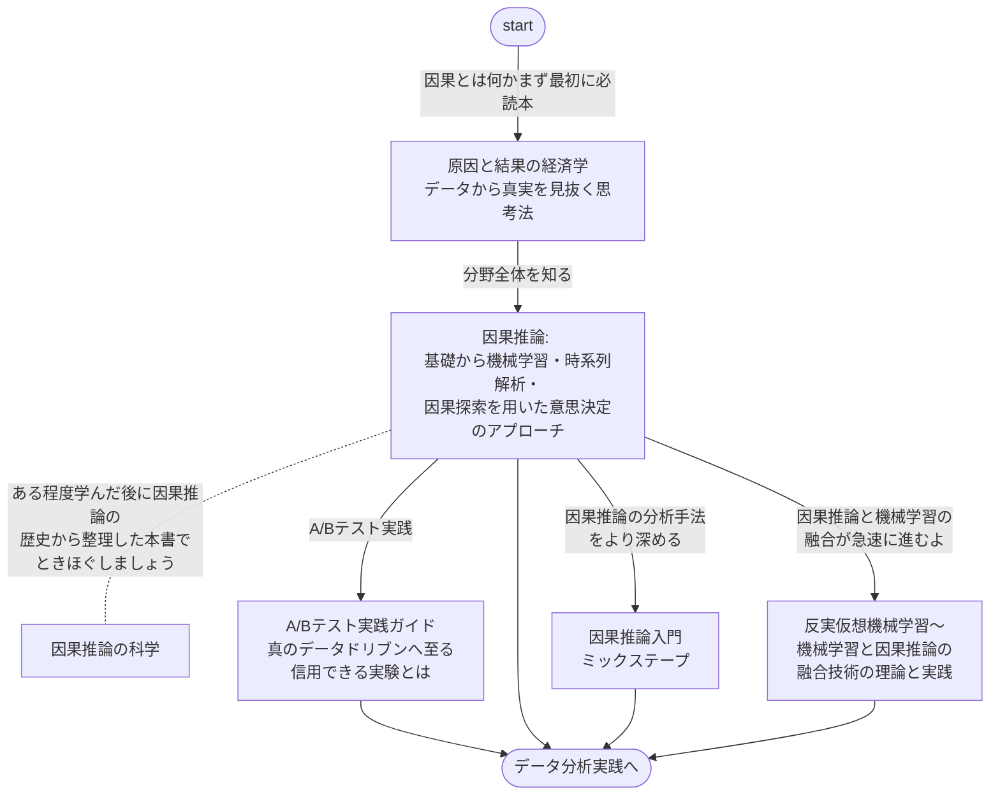
```mermaid
flowchart TD
    id0([start]) -- 因果とは何かまず最初に必読本 --> id1[原因と結果の経済学<br/>データから真実を見抜く思考法]
    id1 -->|分野全体を知る|id2[因果推論: <br/>基礎から機械学習・時系列解析・<br/>因果探索を用いた意思決定のアプローチ]
    id2 -.-|ある程度学んだ後に因果推論の<br/>歴史から整理した本書で<br/>ときほぐしましょう|id4[因果推論の科学]
    id2 -->|因果推論の分析手法<br/>をより深める|id3[因果推論入門<br/>ミックステープ]
    id2 -->|A/Bテスト実践|id7[A/Bテスト実践ガイド<br/>真のデータドリブンへ至る<br/>信用できる実験とは] --> id6
    id2 --> id6([データ分析実践へ])
    id3 --> id6
    id2 -->|因果推論と機械学習の<br/>融合が急速に進むよ|id5[反実仮想機械学習〜<br/>機械学習と因果推論の<br/>融合技術の理論と実践]
    id5 --> id6
```

|書名|概要|
|:--|:--|
|[「原因と結果」の経済学―――データから真実を見抜く思考法](https://amzn.to/3OJ8Od6)<br/><a href="https://amzn.to/3OJ8Od6" target="_blank"></a>|<ul><li/>まずはぜひこの１冊。<li/>前提知識不要で、相関と因果など間違えやすいところが身につく。データ分析、政策等のかなりの専門家でもかなり間違っている人がいる。因果推論を扱うならまずは本書の内容を頭に叩き込む事が一番重要だと思う。<li/>因果推論の基本の下記概念を数式なしで一通り知ることができます。<ul><li/>ランダム化比較実験（RCT）<li/>自然実験<li/>差の差分析<li/>操作変数法<li/>回帰不連続デザイン<li/>マッチング法（傾向スコア）<li/>回帰分析</ul>|
|[因果推論: 基礎から機械学習・時系列解析・因果探索を用いた意思決定のアプローチ](https://amzn.to/4dCbp2e)<br/><a href="https://amzn.to/4dCbp2e" target="_blank"></a>|<ul><li/><font color="blue">new</font>新規追加<li/>因果推論・因果探索の決定版。本職で因果推論や因果探索を行うには必ずしも完璧ではないですが、エンジニアレベルでこの分野を知りたいというなら必要十分ではないでしょうか。<li/>Pearl派の構造的因果モデル、Rubin派の潜在反応モデル。そして因果推論と因果探索。また、最新の機械学習を用いた分析手法まで1冊に偏りなく盛り込まれています。しかもPythonコード例つき。<li/>ミックステープが決定版と思いましたが、因果探索まで扱っていること、機械学習手法も扱っていることもあり、因果推論・因果探索全般を知る１冊としては本書、因果推論の従来手法をもう少し深くならミックステープという使い分けでしょうか。</ul>|
|[因果推論入門〜ミックステープ](https://amzn.to/3KYJcXJ)<br/><a href="https://amzn.to/3KYJcXJ" target="_blank"></a>|<ul><li/>本書の特徴は<li/>ルービン派、パール派に偏らず理論を網羅的に紹介していること。数式もありますがそれで押すのではなくコード例で理解を促していること。<li/>理論の解説がメインですがコード例が豊富。書籍内ではRコードですがサポートサイトにStataやPythonのコード例あり。<li/>また本文内に類書との差別化として下記があり、本書を読めば因果推論の主だった手法を網羅できると言っているようです。<li/><blockquote>Imbens and Rubin (2015)（青木注『インベンス・ルービン 統計的因果推論』）は潜在アウトカムモデル、実験デザイン、マッチングと操作変数法については解説していますが、非巡回有向グラフ(DAG)、回帰不連続デザイン、パネルデータ、合成コントロール方については扱っていません。一方、Morgan and Winship (2014)は、DAG、潜在アウトカムモデル、操作変数法について解説していますが、回帰不連続デザイン、とパネルデータについては軽くしかふれられていませんし、Athey and Imbens (2017b)が過去１５年間で因果推論における重要な革新と呼んだ合成コントロール法についても扱っていません。Angrist and　Picheke　（２００９）は私のニーズにとても近いですが、私が極めて有用と考えている合成コントロール法やグラフィカルモデルについてふれられていません。</blockquote><li/>本書まで学べば余程深く求められない限りひと段落マスターと言って良いのではないかと思います（本式にはインベンス・ルービンが必要だろうけれど</ul>|
|[A/Bテスト実践ガイド 真のデータドリブンへ至る信用できる実験とは](https://amzn.to/3QAqXuW)<br/><a href="https://amzn.to/3QAqXuW" target="_blank"></a>|<ul><li/>「マーケティング」からカテゴリ移動。<li/>Amazon解説文のままですが、まさに下記の通りで必要十分な本かなと思います<blockquote>経営層やリーダー、データサイエンティスト、エンジニア、アナリスト、プロダクトマネージャーなど、企業の全関係者を対象として、その概念から実験を実施するためのプロセス、よくある落とし穴、オンライン実験をスケールさせるために必要なことまで、A/Bテスト、コントロール実験の詳細を解説する。<br/>Google, Amazon, Microsoft, LinkedInなどで実際に実践された経験から得られた教訓や落とし穴などがふんだんに盛り込まれており、データ駆動型の文化の確立、科学的な意思決定に必要なスキルを獲得できる。</blockquote></ul>|
|[反実仮想機械学習〜機械学習と因果推論の融合技術の理論と実践](https://amzn.to/4de9d14)<br/><a href="https://amzn.to/4de9d14" target="_blank"></a>|<ul><li/><font color="blue">new</font>新規追加<li/>因果推論で重要な「存在しない『反事実』をどう扱うか」について、データから「反実仮想」を作り出して比較しようという試み。<li/>因果推論の傾向スコアや強化学習などを駆使して「反事実」をどう作り出すかに挑む。<li/>アカデミアの研究だけではなくて、ネット企業では実務に普通に使われているようです。<li/>データが溢れてきた今日では、この分野が急速に伸びると思うので、やや番外感もありますが先行投資的にリストアップしました。</ul>|
|[因果推論の科学](https://amzn.to/3OkvtLz)<br/><a href="https://amzn.to/3OkvtLz" target="_blank"></a>|<ul><li/>なぜ因果ということを考える必要があるのかなど歴史を通じて現状までを解説した本。<li/>ただ、「因果推論の入門に良い」という書評がありますが、この本をいきなり読んで理解できるのだろうか疑問。ある程度学んだ後に戻ってきて読むと興味深く読めると思う。</ul>|


:::note info
next break
- [Pythonライブラリによる因果推論・因果探索[概念と実践] 因果機械学習の鍵を解く](https://amzn.to/3AAQu1k) 8/20<br/>
    - <a href="https://amzn.to/3AAQu1k" target="_blank"></a>
    - すごい良さそうです読みます！

:::


### 2.3.5 異常検知の2冊
- 製造業を中心に異常検知のテーマは結構ありますが、通常の機械学習の本では扱ってないことが多いです。「ホテリングのT2」とか、製造業の方は統計手法に詳しい方が多いので、こっちが知らないということを避けるために基本的なことは知っておこう
- 『異常検知と変化検知』はここだけちょっと理論書が深すぎるかと思うので100冊からは削除しました（もちろん異常検知をするなら必読と思うよ）

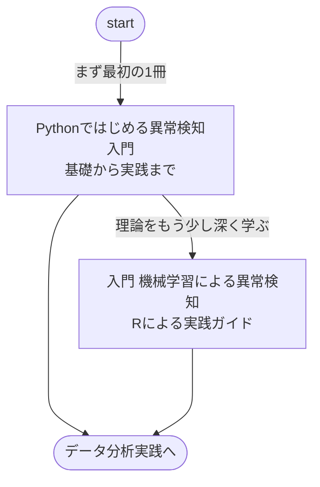
```mermaid
flowchart TD
    id0([start]) -- まず最初の1冊 -->id1[Pythonではじめる異常検知入門<br/>基礎から実践まで]
    id1 -- 理論をもう少し深く学ぶ --> id2[入門 機械学習による異常検知<br/>Rによる実践ガイド]
    id1 ---> id4([データ分析実践へ])
    id2 ---> id4
```

|書名|概要|
|:--|:--|
|[Pythonではじめる異常検知入門 ―基礎から実践まで―](https://amzn.to/3OnclfS)<br/><a href="https://amzn.to/3OnclfS" target="_blank"></a>|<ul><li/>ホテリングT2、k近傍法、One-Class SVMなど異常検知の基礎理論から、時系列異常検知までPythonコード例で学べます</ul>|
|[入門 機械学習による異常検知―Rによる実践ガイド](https://amzn.to/3DLwK9A)<br/><a href="https://amzn.to/3DLwK9A" target="_blank"></a>|<ul><li/>Rの本ですが解説が詳しいので挙げておきます。<li/>異常検知の第一人者である井出先生の定番本。類書が少なく、前著が出るまでは異常検知が必要ならばまず手に取る1冊。<li/>「Rによる実践ガイド」と副題があり、Rによるコード例もありますが、基本は理論の解説。ただ厳密な定義定理スタイルではなく概念の説明が主。<li/>井出先生の [サポートページ](https://ide-research.net/jpn/book/) の内容紹介が詳しくて参考になる。</ul>|


## 2.3.6 ネットワーク分析の1冊
- やっとPythonでのネットワーク分析本も何冊か出てきました。
- 下記2冊は削除しました。
    - 『ネットワーク分析 第2版』はRでの本。
    - 『ネットワーク科学: ひと・もの・ことの関係性をデータから解き明かす新しいアプローチ』はネットワーク分析をするならば読んだ方がいいと思いますが、100冊には濃すぎる。

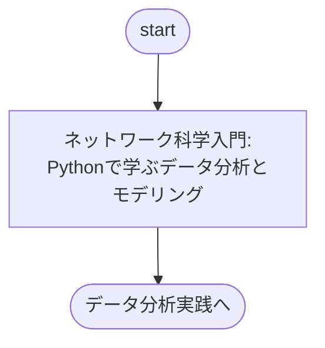
```mermaid
flowchart TD
    id0([start]) --> id1["ネットワーク科学入門:<br/>Pythonで学ぶデータ分析とモデリング"]
    id1 -->id2([データ分析実践へ])
```

|書名|概要|
|:--|:--|
|[ネットワーク科学入門:<br/>Pythonで学ぶデータ分析とモデリング](https://amzn.to/3WPkON5)<br/><a href="https://amzn.to/3WPkON5" target="_blank"></a>|<ul><li/><font color="blue">new</font><li/>この分野は理論書かRによる実装本が充実していて、Pythonによる本はすくなかったのです。やっと分野を俯瞰しつつPythonで学べる本が出ました。</ul>|

### 2.3.7. スパースモデリングの２冊
- 機械学習の本に少しだけ記載がありますが、しっかり学ぶのであれば下記の本など。
- 理論書や演習書などあり、昨年度は少し紹介しましたが未読のままなので削除しました。

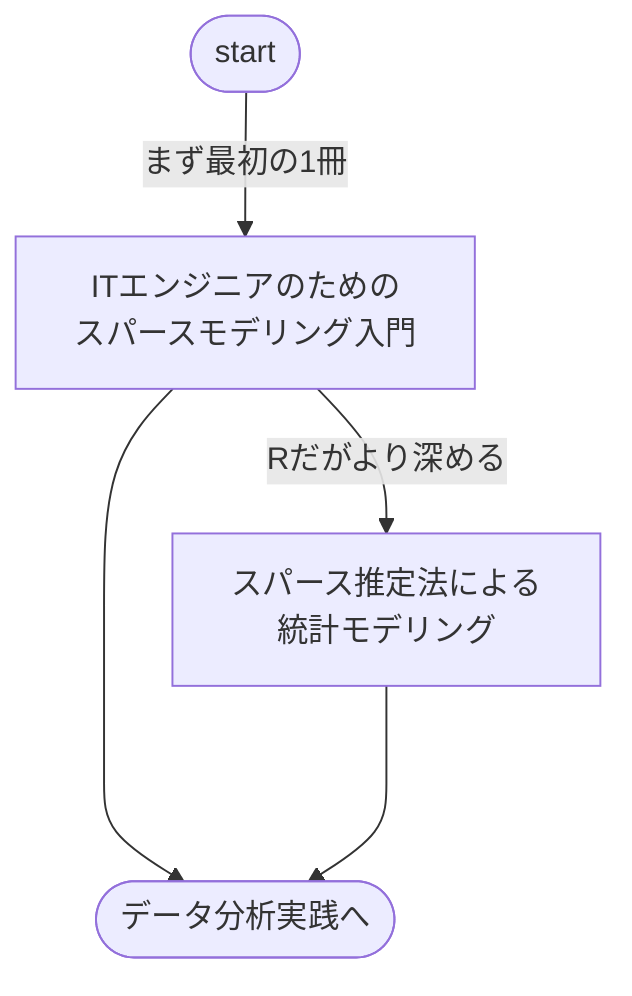
```mermaid
flowchart TD
    id0([start]) -- まず最初の1冊 -->id1[ITエンジニアのための<br/>スパースモデリング入門]
    id1 -- Rだがより深める --> id2[スパース推定法による<br/>統計モデリング]
    id1 ---> id5([データ分析実践へ])
    id2 ---> id5
```

|書名|概要|
|:--|:--|
|[ITエンジニアのためのスパースモデリング入門](https://amzn.to/3KEoY54)<br/><a href="https://amzn.to/3KEoY54" target="_blank"></a>|<ul><li/>スパースモデリングの代表的なアルゴリズムであるLassoについてPythonコード付きで学べます</ul>|
|[スパース推定法による統計モデリング](https://amzn.to/3OvU68a)<br/><a href="https://amzn.to/3OvU68a" target="_blank"></a>|<ul><li/>コード例がRなものの、前著はどちらかというと動かしてみる重視ですが、本書はより理論について解説があり、理解が深まるかと思います</ul>|


### 2.3.8. 強化学習の2冊
- これも実案件経験がほぼないです。案件が来た時の前捌きとして読んでおります。
- これだけでは実案件に対応できないのはわかりますが、最低限の知識として。
- ここも類書多数ありますが、定評ある本なども残念ながら未読なものは未掲載。Sutton本も初版読んだのですが、難しくて理解できず、外しています。その他多数読みましたが最低限間違いなさそうという、読んだものの中で良さそうなもののみに絞っております。

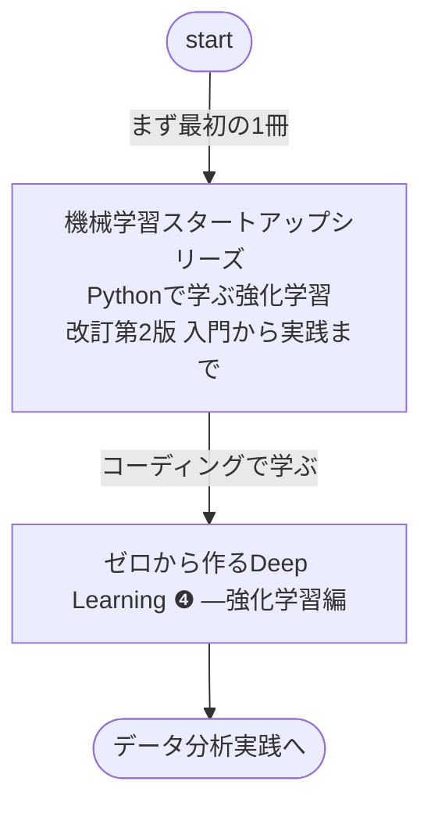
```mermaid
flowchart TD
    id0([start]) -- まず最初の1冊 -->id1[機械学習スタートアップシリーズ<br/>Pythonで学ぶ強化学習<br/>改訂第2版 入門から実践まで]
    id1 -->|コーディングで学ぶ|id2[ゼロから作るDeep Learning ❹ ―強化学習編]
    id2 --> id3([データ分析実践へ])
```
    
|書名|概要|
|:--|:--|
|[機械学習スタートアップシリーズ Pythonで学ぶ強化学習 [改訂第2版] 入門から実践まで](https://amzn.to/3QnygWY)<br/><a href="https://amzn.to/3QnygWY" target="_blank"></a>|<ul><li/>本記事著者ときは初版を読んだが、初版が出てまもなく改版が出ている。<li/>Pythonコード付きで強化学習の基本からDQNなど主要なアルゴリズムを学べる。Pythonを知っており、ある程度機械学習などをやったことがある人ならば最初の1冊にいいかも。<li/>著者によるサポートページicoxfog417/baby-steps-of-rl-jaが充実している。</ul>|
|[ゼロから作るDeep Learning ❹ ―強化学習編](https://amzn.to/4dOs1UK)<br/><a href="https://amzn.to/4dOs1UK" target="_blank"></a>|<ul><li/><font color="blue">new</font>新規追加<li/>ご存知「ゼロから作るDeep Learning」シリーズの第4弾。このシリーズは間違い無いですね。</ul>|

## 2.3.9. ベイズ統計・ベイズ機械学習の4冊
- この分野も類書が増えてきましたね。昔はRによる『データ解析のための統計モデリング入門――一般化線形モデル・階層ベイズモデル・MCMC (確率と情報の科学)』か超むずの本しかなかったのですが。
- 理論が作りにくい分野でデータが大量に得られるようになったからでしょうか。
- 実務で直接（アルゴリズム内部では広い分野で使われてますね）ほとんど扱ったことがないのですが、最低限の知識として。
- 正直本記事著者青木はベイズ統計・ベイズ機械学習あたりが「しっくり」まだ来ていません。なんだろうこの感じ。今後もひたすら読んでいきます。

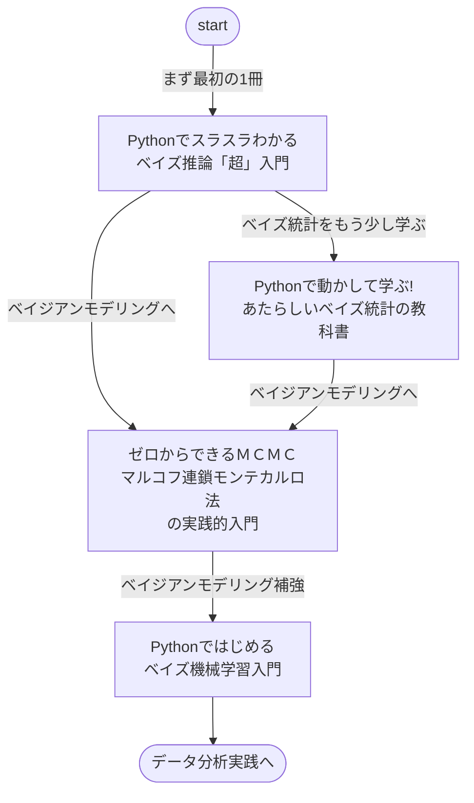
```mermaid
flowchart TD
    id0([start]) -- まず最初の1冊 --> id1[Pythonでスラスラわかる<br/>ベイズ推論「超」入門]
    id1 -->|ベイズ統計をもう少し学ぶ|id2[Pythonで動かして学ぶ!<br/>あたらしいベイズ統計の教科書]
    id1 & id2 -->|ベイジアンモデリングへ|id3[ゼロからできるＭＣＭＣ<br/>マルコフ連鎖モンテカルロ法<br/>の実践的入門]
    id3 -->|ベイジアンモデリング補強|id4[Pythonではじめる<br/>ベイズ機械学習入門]
    id4 --> id5([データ分析実践へ])
```

|書名|概要|
|:--|:--|
|[Pythonでスラスラわかる ベイズ推論「超」入門](https://amzn.to/3YNyaw4)<br/><a href="https://amzn.to/3YNyaw4" target="_blank"></a>|<ul><li/><font color="blue">new</font><li/>おそらく本書が一番「入門」なのでは。タイトルに「『超』入門」とあるのがベイズ推論の難しさを物語っているのかな。本書で救われる方も多いはず。</ul>|
|[Pythonで動かして学ぶ! あたらしいベイズ統計の教科書](https://amzn.to/3OVIf4H)<br/><a href="https://amzn.to/3OVIf4H" target="_blank"></a>|<ul><li/>『[データ解析のための統計モデリング入門](https://amzn.to/3YOD7T6)』(みどり本)が有名ですがこの本はR系なのでやめました<li/>ベイズ統計の基礎から、MCMCを用いたベイズ推計、一般化線形モデルの基本まで、PyMC3ライブラリを用いて実装しながら学べます</ul>|
|[ゼロからできるＭＣＭＣ　マルコフ連鎖モンテカルロ法の実践的入門](https://amzn.to/3ABIkFL)<br/><a href="https://amzn.to/3ABIkFL" target="_blank"></a>|<ul><li/><font color="blue">new</font><li/>c言語実装だけどな（これをPythonで書き直したりしたら実力つくのだろうな←自分に言っているもちまだやっていない）<li/>習うより慣れろ派なので新たに追加MCMCに特化して解説</ul>|
|[Pythonではじめるベイズ機械学習入門](https://amzn.to/3KHuSTa)<br/><a href="https://amzn.to/3KHuSTa" target="_blank"></a>|<ul><li/>前記書よりより深く、ベイジアンモデリングやベイジアンニューラルネットワークまでを学びます</ul>|


### 2.3.10. 評価指標・XAIの4冊
- 機械学習モデルの評価指標はLogLossが一般的だけれど、一般の方には伝わらない。一般の方には正解率が伝わりやすいですがTrue/Negativeが偏っている時や多群の時は微妙。テーマやユーザーの方が何を求めているかによって評価指標の良し悪しを見極めて適用する必要がある
- 機械学習はブラックボックスと言われてきましたがある程度まで中身がわかるようになってきました。XAIという呪文みたいな名前ですが、機械学習の説明性はビジネス用途のデータ分析では重要と思います。
- 『機械学習を解釈する技術』はRでの実装なので、類書も増えたところで削除。

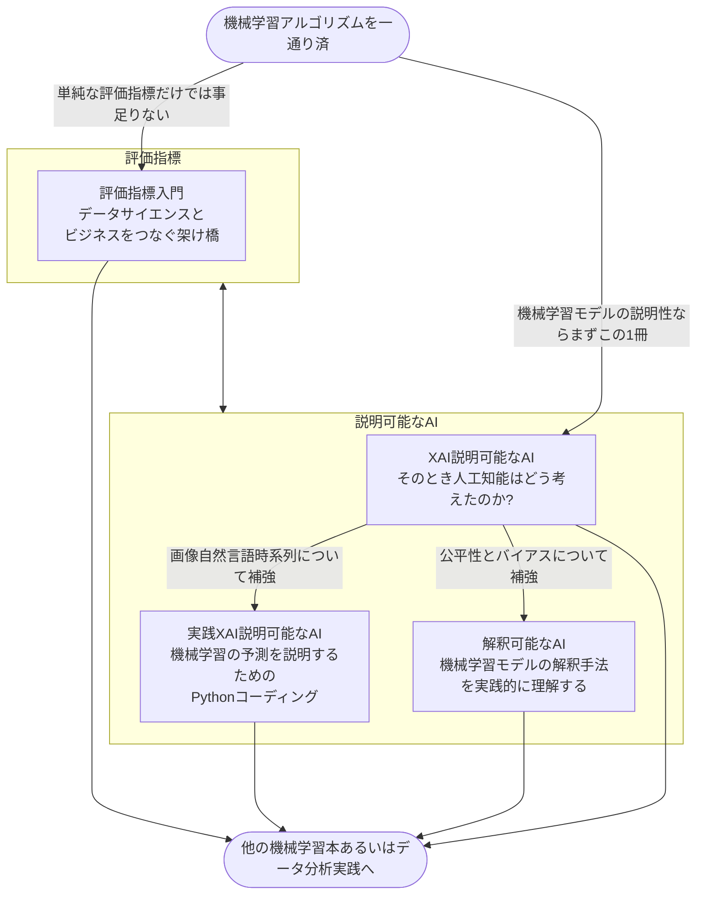
```mermaid
flowchart TD
    id0([機械学習アルゴリズムを一通り済]) -- 単純な評価指標だけでは事足りない --> id1
    id0 -- 機械学習モデルの説明性ならまずこの1冊 --> id2
    subgraph sub1 [評価指標]
        id1[評価指標入門<br/>データサイエンスと<br/>ビジネスをつなぐ架け橋]
    end
    subgraph sub2 [説明可能なAI]
        id2[XAI説明可能なAI<br/>そのとき人工知能はどう考えたのか?]-- 画像自然言語時系列について補強--> id4[実践XAI説明可能なAI<br/>機械学習の予測を説明するための<br/>Pythonコーディング]
        id2 -->|公平性とバイアスについて補強|id5[解釈可能なAI<br/>機械学習モデルの解釈手法<br/>を実践的に理解する]
    end
    id1 & id2 & id4 & id5 ---> id6([他の機械学習本あるいはデータ分析実践へ])
    sub1 <---> sub2
    
```

|書名|概要|
|:--|:--|
|[評価指標入門〜データサイエンスとビジネスをつなぐ架け橋](https://amzn.to/3OJHOdB)<br/><a href="https://amzn.to/3OJHOdB" target="_blank"></a>|<ul><li/>評価指標については機械学習解説本の中で触れられてはいましたが、その理論の解説がメインであり、どうビジネスのKPIとつなげるか等の解説は手薄だったと思います。<li/>Amazon紹介ページにあるように、本書ではデータサイエンスの空間とビジネスの空間での「指標」が異なることを意識し、それらの「指標」の特徴をしっかり把握した上で、どうつないでいくか、を解説してくれています。<li/><blockquote>「評価指標でXXXという最高のスコアが出た！」と喜び勇んで、機械学習モデルが出力してくる予測結果をもとにビジネスを運用したとします。 ところが、ビジネス上のKPIと相関が高い評価指標を選んでいなかったために、KPIの推移を見てみると大した変化がありませんでした。<br/>（中略）<br/>このような状況が起きてしまう背景にはさまざまな原因が考えられますが、あえて一言で言うと「データサイエンスの問題が解くべきビジネスの問題と乖離していた」ためです。<br/>(中略)<br/>本書はこれらの疑問に答えるため、機械学習の良し悪しを決める評価指標を軸に、解くべきビジネスの問題をどうやってデータサイエンスの問題に落とし込むのか、その原理を解説していきます。この原理が普遍的なものであれば、ビジネスがどんなものであっても応用できると考えることができます。</blockquote></ul>|
|[XAI(説明可能なAI)--そのとき人工知能はどう考えたのか?](https://amzn.to/3qjB10U)<br/></a>|<ul><li/>AIの説明性について、ネット記事もお客様とのやりとりの中でも話題に挙がることが増えた。<li/>大極的説明、局所説明などの考え方の整理から、LIME, SHAP, Permutation Importance, Partial Dependence Plot, Tree Surrogate, CAM/Grad-CAM, Integrated Gradientsなどの具体的なアルゴリズムの説明、実装例及びそれぞれの得手不得手などが詳しい。<li/>Kaggleなどのコンペでスコア上位を目指すのではなく、実務で機械学習を用い内容の説明が求められるならば必須ではないか。</ul>|
|[実践XAI［説明可能なAI］ 機械学習の予測を説明するためのPythonコーディング](https://amzn.to/3rXd2oG)<br/></a>|<ul><li/>概念の整理は『XAI(説明可能なAI)--そのとき人工知能はどう考えたのか?』の方がわかりやすいが、本書は、自然言語や、画像、時系列など幅広く扱っている</ul>|
|[解釈可能なAI　機械学習モデルの解釈手法を実践的に理解する (Compass Booksシリーズ)](https://amzn.to/4dNh1qA)<br/><a href="https://amzn.to/4dNh1qA" target="_blank"></a>|<ul><li/><font color="blue">new</font>新規追加<li/>類書では薄目であった「公平性とバイアス」の解釈についても新たに追加されています。</ul>|


## 2.4. データ可視化の6冊
- 基礎集計のための可視化と、分析結果を共有するための可視化があるかと思います。ここでは特に分けずにリストしています。
- データ構造、分析内容が複雑となってきており、ユーザーへの説明はもちろん分析者自身もその結果を共有するのに苦労します。可視化は今後ますます重要になってくると思います。
- その他関連書を [データ可視化の本10冊](https://note.com/aokikenichi/n/ncd39ed201983) にも書いております ←これも更新しなきゃだごめん

https://note.com/aokikenichi/n/ncd39ed201983

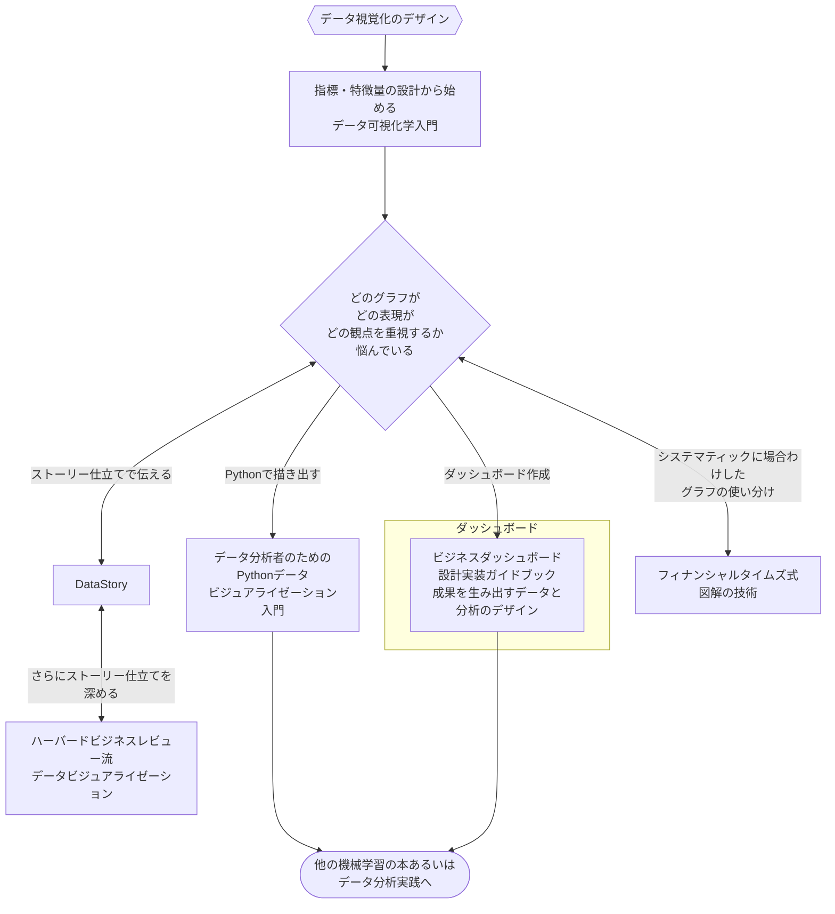
```mermaid
flowchart TD
    id0{{データ視覚化のデザイン}} --> id1[指標・特徴量の設計から始める<br/>データ可視化学入門]
    id1 ---> id2{どのグラフが<br/>どの表現が<br/>どの観点を重視するか<br/>悩んでいる}
    id2 -- Pythonで描き出す --> id3[データ分析者のための<br/>Pythonデータ<br/>ビジュアライゼーション<br/>入門]
    id2 <-- ストーリー仕立てで伝える --> id4[DataStory]
    id4 <-- さらにストーリー仕立てを深める --> id5[ハーバードビジネスレビュー流<br/>データビジュアライゼーション]
    id2 <-- システマティックに場合わけした<br/>グラフの使い分け --> id6[フィナンシャルタイムズ式<br/>図解の技術]
    id3 ---> id8([他の機械学習の本あるいはデータ分析実践へ])
    id2 -- ダッシュボード作成 --> id7
    subgraph sub1 [ダッシュボード]
        id7[ビジネスダッシュボード<br/>設計実装ガイドブック<br/>成果を生み出すデータと<br/>分析のデザイン]
    end
    id7 ---> id8
```

|書名|概要|
|:--|:--|
|[指標・特徴量の設計から始める データ可視化学入門](https://amzn.to/4cthmxw)<br/><a href="https://amzn.to/4cthmxw" target="_blank"></a>|<ul><li/><font color="blue">new</font>新規追加<li/>他の本は、可視化までのデータ集計はすでにあって、「どう表現すると読み手に伝わるか」がメインなのですが、本書は「そのデータの特徴を表すのにはどのような加工、まとめ方があるか」の方にメインを置いているんですね、そこがいい。<li/>つまりデータ可視化だけではなく、特徴量エンジニアリングはどうしたら機械学習に適したデータ加工ができるかですが、そのなんていうんだろう、可視化エンジニアリングともいうべき内容なんですよ。<li/>数量を把握する、メカニズムをとらえる、多変数をとらえる、データの分布をとらえる、関係性をとらえる、パターンをとらえる、の観点でノウハウを教えてくれます。<li/>『データ視覚化のデザイン』とどちらを10冊に入れようか迷ったのですが、『データ視覚化のデザイン』は万人に必須、本書はどちらかというとデータ分析するならば必須という感じですかね。</ul>|
|[フィナンシャルタイムズ式 図解の技術](https://amzn.to/45rsKXu)<br/><a href="https://amzn.to/45rsKXu" target="_blank"></a>|<ul><li/>フィナンシャルタイムズの編集者が図解を９カテゴリ７４図に分け、丁寧に解説しています。<li/>グラフはなんとなく描くものではなく、何を示したいかにより使い分けるということです<li/>７４図中１２図ですがまだ、 [図解の言語をすべてPythonで実装例を作成する目論見](https://github.com/aokikenichi/aokikenichi/blob/main/FT%E5%9B%B3%E8%A7%A3%E3%81%AE%E8%A8%80%E8%AA%9E.ipynb) を公開しています。</ul>|
|[DataStory: 人を動かすストーリーテリング](https://amzn.to/44YaaX8)<br/><a href="https://amzn.to/44YaaX8" target="_blank"></a>|<ul><li/>精度が良いモデルができてもビジネス展開できなければ意味がない。<li/>上司や現場の担当に「RMSEが○○で……」では伝わらず分かりやすくストーリー立てた可視化による説明が必要となる。<li/>可視化のライブラリ解説や、スライド作成等の本はありますがAmazon紹介文にあるように、下記のような内容の本は今までほとんどなかったと思います。<blockquote>「共感」というレンズを通してデータを説明すること<br/>データをストーリーにして相手の行動を促す方法<br/>上司や不特定多数の人に承認される提案書のつくりかた<br/>グラフの所見をわかりやすく書き、注釈を付ける方法<br/>スライドの構成とレイアウトについてのコツ<br/>データに命を吹き込み、記憶に残るものにして相手の行動を促す方法</blockquote></ul>|
|[ハーバード・ビジネス・レビュー流 データビジュアライゼーション](https://amzn.to/3qkozy5)<br/><a href="https://amzn.to/3qkozy5" target="_blank"></a>|<ul><li/>前著『フィナンシャルタイムズ式 図解の技術』とコンセプトは被ります<li/>フィナンシャルタイムズとこちらはハーバード・ビジネス・レビューのノウハウの違い<li/>どちらもビジネス系の複雑なデータをどうわかりやすく表現するかと考え抜いている専門家のノウハウなので有益ですが強いてあげると、前者は「図解の言語」としてシステマティックに分類を、本書はDataStoryと同じくどういうストーリーで表現するかに重きを置いてますが、こだわるならばどちらも読んだ方が良いと思います<li/>直接この本についてではにですが同じチートシートをPython/matplotlibで実装している記事がありました[ケース別データの可視化パターンとpythonによる実装](https://qiita.com/HiromuMasuda0228/items/3fe750a6ccb64e2f3d44)</ul>|
|[データ分析者のためのPythonデータビジュアライゼーション入門](https://amzn.to/3On9Lq7)<br/><a href="https://amzn.to/3On9Lq7" target="_blank"></a>|<ul><li/>棒グラフ、ヒストグラム、散布図など代表的なものから地図情報、ワードクラウド、インフォグラフィックスの触りまで、Pythonによるコード例付きで分かりやすいです。Pythonでデータ可視化をするならばまず手に取りたい1冊です。</ul>|
|[ビジネスダッシュボード 設計・実装ガイドブック 成果を生み出すデータと分析のデザイン](https://amzn.to/3rYWi0b)<br/><a href="https://amzn.to/3rYWi0b" target="_blank"></a>|<ul><li/>CDP（カスタマーデータプラットフォーム）の第一人者トレジャーデータの専門家がダッシュボードについて解説した本<li/>トレジャーデータのツールに依ることなく一般論として語られているのでツール関係なくノウハウを学べます</ul>|

:::note info
next break
- [データ可視化の基本が全部わかる本 収集・変換からビジュアライゼーション・データ分析支援まで](https://amzn.to/3ApLo81) 8/28発売
<a href="https://amzn.to/3ApLo81" target="_blank"></a>
    - これも惹かれる
:::

## 2.5. 分野固有のデータ
### 2.5.1. 自然言語処理の6冊
- 自然言語処理はどういう業界でも必要なので絶対必要と思っていたけれど大規模言語モデルの大波がこんなに早く強くくるとは気づかなかった！
- 生成AIと明確に分けられるものでもないですが（LLMはどっちなんだとか）今回は分けてみました。こちらのカテゴリは従来のテキストアナリクス＋自然言語処理＋大規模言語モデルくらいまで。
- 関連記事を下記にも書いております
    - [【データ分析の必読10冊+差をつける10冊＋100冊超】データサイエンス、データ分析、機械学習関連の本#キストマイニング、自然言語処理](https://qiita.com/aokikenichi/items/ae4df263f591e47528a6#%E3%83%86%E3%82%AD%E3%82%B9%E3%83%88%E3%83%9E%E3%82%A4%E3%83%8B%E3%83%B3%E3%82%B0%E8%87%AA%E7%84%B6%E8%A8%80%E8%AA%9E%E5%87%A6%E7%90%86) にもその他の本を書いています。
    - [大規模言語モデル(LLM)とそれまでの技術の流れを入門用にまとめた](https://qiita.com/aokikenichi/items/14ad95aacf2092aacbdd)
        - 大規模言語モデル関連本を


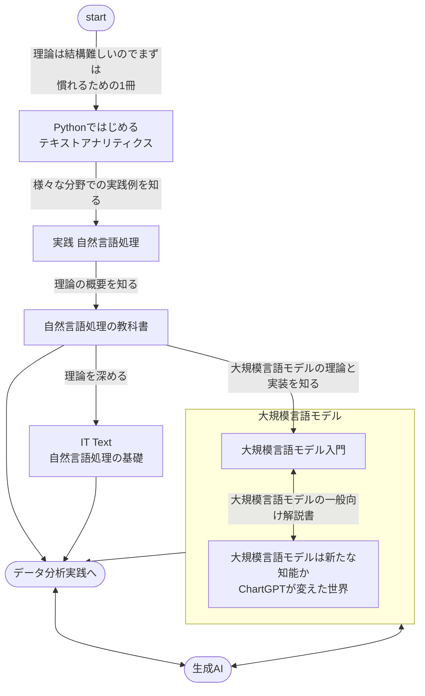
```mermaid
flowchart TD
    id0([start]) -- 理論は結構難しいのでまずは<br/>慣れるための1冊 --> id1[Pythonではじめる<br/>テキストアナリティクス]
    id1 -- 様々な分野での実践例を知る --> id2[実践 自然言語処理]
    id2 -->|理論の概要を知る|id3[自然言語処理の教科書]
    id3 -->|理論を深める|id4[IT Text<br/>自然言語処理の基礎]
    id3 --> id99([データ分析実践へ])
    id4 --> id99
    id3 -- 大規模言語モデルの理論と実装を知る --> id5[大規模言語モデル入門]
    sub1 --> id99

    id99 <--> id100([生成AI])
    sub1 <--> id100
    subgraph sub1 [大規模言語モデル]
        id5 <-- 大規模言語モデルの一般向け解説書 --> id6[大規模言語モデルは新たな知能か<br/>ChartGPTが変えた世界]
 
    end
```

|書名|概要|
|:--|:--|
|[Pythonではじめるテキストアナリティクス入門](https://amzn.to/3DNyNKj)<br/><a href="https://amzn.to/3DNyNKj" target="_blank"></a>|<ul><li/>いきなりChatGPTを操りたくなると思いますが、まずは基本の形態素解析やTF-IDFなどの頻度分析から触れるべきだと思う<li/>本書は自然言語取扱の基礎から、口コミを利用した観光地の分析、有価証券報告書を用いた日経平均予想、Twitter・２ちゃんねるデータによる分析などで基礎を身につけることができます</ul>|
|[実践 自然言語処理 ―実世界NLPアプリケーション開発のベストプラクティス](https://amzn.to/3qmH4St)<br/><a href="https://amzn.to/3qmH4St" target="_blank"></a>|<ul><li/>技術の解説・コード例ということではなく現実の問題への適用集<li/>テキスト分類、情報抽出、チャットボット、情報検索、トピックモデル、要約、推薦システム、機械翻訳、質問応答システム<li/>SNS、Eコマース、医療・金融・法律への適用事例<li/>日本語版のみ巻末に日本語自然言語処理ライブラリSpaCyの解説記事がある。<li/>本書の公式サイト https://www.practicalnlp.ai/<li/>本書のコード例ノートブック Practical Natural Language Processing<li/>ライブラリとしてTransformersなどを用いている</ul>|
|[自然言語処理の教科書](https://amzn.to/3WO5hxe)<br/><a href="https://amzn.to/3WO5hxe" target="_blank"></a>|<ul><li/><font color="blue">new</font>新規追加<li/>前書きに<blockquote>本書は開発に関するハンドブックになることを目指しているので、研究に興味があるという人は、放送大学の教科書『自然言語処理〔三訂版〕』（放送大学教育振興会, 2023）または『IT　Text 自然言語処理の基礎』（オーム社, 2022）をお読みください。</blockquote>とあり、まさにエンジニアの入門用の教科書ですね。<li/>数式は最小限で従来の自然言語処理からTransformerや大規模言語モデル、そしてコーパスなどの話題を広く扱っています。<li/>前書きにある通りこの本の後に次の『IT Text 自然言語処理の基礎』を読むと良さそう。</ul>|
|[IT Text 自然言語処理の基礎](https://amzn.to/442MDD7)<br/><a href="https://amzn.to/442MDD7" target="_blank"></a>|<ul><li/>がち<li/>大規模言語モデルの流行でプロンプトがどうしたこうしたと浮ついた本がたくさん出ていますが、それだけでは解決しないし、すぐ流行り廃りはあるし<li/>でもインターネットの移ろいがあってもTCP/IPが全く揺るがないように根っこの技術を学ぼうじゃないか<blockquote>第1章　自然言語処理の概要<br/>第2章　自然言語処理のための機械学習の基礎<br/>第3章　単語ベクトル表現<br/>第4章　系列に対するニューラルネットワーク<br/>第5章　言語モデル・系列変換モデル<br/>第6章　Transformer<br/>第7章　事前学習済みモデルと転移学習<br/>第8章　系列ラベリング<br/>第9章　構文解析<br/>第10章　意味解析<br/>第11章　応用タスク・まとめ</blockquote></ul>|
|9/4に第二版が出るらしい[大規模言語モデル入門Ⅱ〜生成型LLMの実装と評価](https://amzn.to/46PVbjO)<br/></a><br/><br/>[大規模言語モデル入門](https://amzn.to/3QA7NFP)<br/><a href="https://amzn.to/3QA7NFP" targer="_blank"></a>|<ul><li/>transformersライブラリを用いてコーディングしながら大規模言語モデルの理論と実装の両方を体験できる嬉しい本<li/>『IT Text 自然言語処理の基礎』下記のような目次で、大規模言語モデルを一通り学べる<blockquote>第1章はじめに(transformersを使って自然言語処理を解いてみよう)<br/>第2章 Transformer<br/>第3章 大規模言語モデルの基礎<br/>第4章大規模言語モデルの進展<br/>第5章 大規模言語モデルのファインチューニング<br/>第6章 固有表現認識<br/>第7章 要約生成<br/>第8章 文埋め込み<br/>第9章 質問応答</blockquote></ul>|
|[大規模言語モデルは新たな知能か　ＣｈａｔＧＰＴが変えた世界](https://amzn.to/3QDlAeH)<br/><a href="https://amzn.to/3QDlAeH" target="_blank"></a>|<ul><li/>大規模言語モデルがこんな流行るとは！<li/>雨後の筍のように便乗本が出ていますがほとんどは消えます。この記事を読むような方は本質を<li/>難しいのですが、PFNの岡野原さんが分かりやすい解説書を出してくれました</ul>|


### 2.5.2. 生成AIの6冊
- 大規模言語モデルを中心としながらも画像や音声も含めた生成AIについてこのカテゴリにまとめました。
- LangChain系も何冊か読みましたがしっくり理解できてないので掲載しておりません。
- 画像生成系も作曲系も同じく何冊か読みましたが、100冊に来ない趣味レベルで読んでいるだけかなと今回は見送りです。


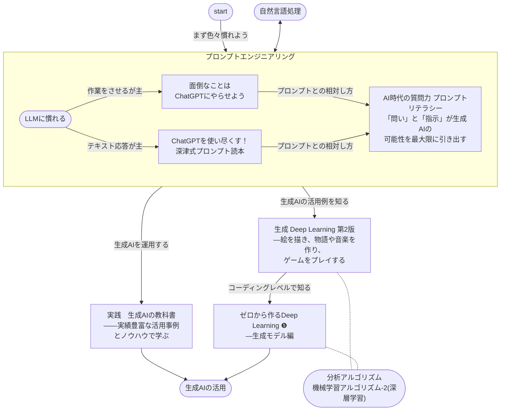
```mermaid
flowchart TD
    id0([start])

    id0 -->|まず色々慣れよう|sub1
    subgraph sub1 [プロンプトエンジニアリング]
        id10([LLMに慣れる])
        id11[面倒なことは<br/>ChatGPTにやらせよう]
        id12[ChatGPTを使い尽くす！<br/>深津式プロンプト読本]
        id13[AI時代の質問力 プロンプトリテラシー<br/>「問い」と「指示」が生成AIの<br/>可能性を最大限に引き出す]
        id10 -->|作業をさせるが主|id11
        id10 -->|テキスト応答が主|id12
        id11 -->|プロンプトとの相対し方|id13
        id12 -->|プロンプトとの相対し方|id13
    end

    sub1 -->|生成AIを運用する|id1[実践　生成AIの教科書<br/>――実績豊富な活用事例<br/>とノウハウで学ぶ]
    sub1 -->|生成AIの活用例を知る|id2["生成 Deep Learning 第2版<br/>―絵を描き、物語や音楽を作り、<br/>ゲームをプレイする"]
    id2 -->|コーディングレベルで知る|id3["ゼロから作るDeep Learning ❺<br/>―生成モデル編"]
    
    id100([自然言語処理])
    id100 <--> sub1
    id2 & id3 -.- id99(["分析アルゴリズム<br/>機械学習アルゴリズム-2(深層学習)"])
    id1 --> id1000([生成AIの活用])
    id3 --> id1000
```

|書名|概要|
|:--|:--|
|[面倒なことはChatGPTにやらせよう](https://amzn.to/4dKD9BQ)<br/><a href="https://amzn.to/4dKD9BQ" target="_blank"></a>|<ul><li/><font color="blue">new</font>新規追加<li/>2024-01発売でもう「古株」ですね！<li/>類書がたくさん出ていますが、**「ChatGPTになんらか作業をさせる」という意味では本書が一番いい**かなと思います。<li/>その後たくさん出た類書は「編集者に尻を叩かれながら薄い内容を盛って感」があるのですけれど本書は、「痒い所に手が届く感」というか「吟味したノウハウを取捨選択している感」があるんですよね。<li/>著者さんがKaggle本の「うすい本」など、技術出版界隈のせいもあるのかな。</ul>|
|[ChatGPTを使い尽くす！　深津式プロンプト読本](https://amzn.to/4cyeuzr)<br/><a href="https://amzn.to/4cyeuzr" target="_blank"></a>|<ul><li/><font color="blue">new</font>新規追加<li/>というわけで「面倒なことは」本の後何冊か読みましたが決定打はなく、類書の海に溺れそうなところ、上記書の著者カレーちゃんさんが推薦したので<li>あとは私の評よりもカレーちゃんさんの評の方が響くと思うので。**テキスト生成やQ＆Aのビジネス利用なら本書**ってところですかね。<br/>https://x.com/currypurin/status/1822441965927215410<br/>https://x.com/currypurin/status/1822444030112010700</ul>|
|[AI時代の質問力 プロンプトリテラシー 「問い」と「指示」が生成AIの可能性を最大限に引き出す](https://amzn.to/4dMD7t9)<br/><a href="https://amzn.to/3WO5hxe" target="_blank"></a>|<ul><li/><font color="blue">new</font>新規追加<li/>ペルソナパターンとか、Chain-of-Thoughtパターン、ReACTパターンとか類書のTips集のような章見出しが並んではいるのですが、単なるTips集ではありません。<li/>わざわざ「リテラシー」と題しているだけはあり、プロンプトのTips的はものはほとんどありません。<li/>プロンプトを考える時のOSかなと思うのですけれど。<li/>繰り返しですが、<ul><li/>**作業させるなら『面倒なことはChatGPTにやらせよう』**<li/>**テキストのやり取りなら『深津式プロンプト』**<li/>**土台となる考え方なら『プロンプトリテラシー』**</ul>というような立ち位置かなと思います。</ul>|
|[実践　生成AIの教科書 ――実績豊富な活用事例とノウハウで学ぶ](https://amzn.to/3MavZLj)<br/><a href="https://amzn.to/3MavZLj" target="_blank"></a>|<ul><li/><font color="blue">new</font>新規追加<li/>日立さんにより企業に生成AIを導入するにはのノウハウと注意点など。<li/>類書は単に機能紹介がメインですけれど、企業で使うには組織をどうするか倫理やセキュリティはとたくさん気になりますがそこらへんまでカバーしています。<li/>これらもネット記事が氾濫しているので、そちらを見るのもアリですが、日立さんがこの生成AIの時代に自社名を全面に出している本とのことで、気概見たいのが感じられて整理に良いかと。</ul>|
|[生成 Deep Learning 第2版 ―絵を描き、物語や音楽を作り、ゲームをプレイする](https://amzn.to/3M1Sq5p)<br/><a href="https://amzn.to/3M1Sq5p" target="_blank"></a>|<ul><li/> <font color="red">update</font> 新しい版。<li/>ごめん初版は読んだが、この新しい版はまだ読み中でも間違いないでしょう<li/>今最も熱い分野ですね。初版に比べ最新動向を盛り込みつつ、マルチモーダルの強化、そして「世界モデル」についても触れています。</ul>|


    
### 2.5.3. 時系列分析の7冊
- 時系列分析について私の経験が一番多いので多めになちゃいました。
- 需要予測をはじめどの業界でも出てくるデータだと思います。ただ、見せかけの回帰など時系列データならではの通常の回帰とは異なる点が多々あり、気をつけるためにもしっかりと学びたいところです
- その他関連書は [【決定版】需要予測・市況予測のための時系列分析の本リスト](https://qiita.com/aokikenichi/items/48d5dfaf3bd06da653dc) ←これも更新しなきゃだ

https://qiita.com/aokikenichi/items/48d5dfaf3bd06da653dc

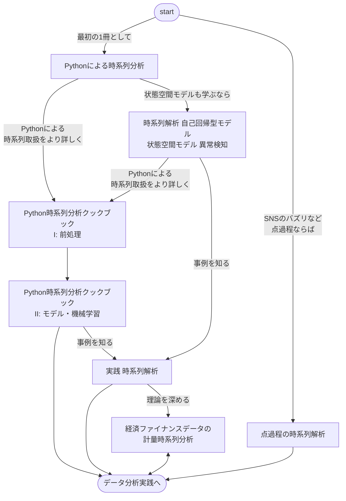
```mermaid
flowchart TD
    id0([start]) -- 最初の1冊として --> id1[Pythonによる時系列分析]
    id1 -- 状態空間モデルも学ぶなら --> id2[時系列解析 自己回帰型モデル<br/>状態空間モデル 異常検知]
    id1 -->|Pythonによる<br/>時系列取扱をより詳しく|id2a[Python時系列分析クックブック<br/>I: 前処理]
    id2 -->|Pythonによる<br/>時系列取扱をより詳しく|id2a
    id2a --> id2b[Python時系列分析クックブック<br/>II: モデル・機械学習]
    id2b -->|事例を知る|id3[実践 時系列解析]
    id2 -->|事例を知る|id3
    id3 -->|理論を深める|id4[経済ファイナンスデータの<br/>計量時系列分析]
    id2b --> id5([データ分析実践へ])
    id3 --> id5
    id4 <--> id5
    id0 -- SNSのバズリなど<br/>点過程ならば --> id6[点過程の時系列解析]
    id6 --> id5
```

|書名|概要|
|:--|:--|
|[Pythonによる時系列分析](https://amzn.to/44V5Zvr)<br/><a href="https://amzn.to/44V5Zvr" target="_blank"></a>|<ul><li/>下記本が最初の1冊と思っていましたが、本書の方が網羅性、実践例もあり適切か<li/>時系列データの特徴、時系列分析手法の概要、そして異常検知、未来予測等のビジネス事例が７つと最初の１冊として十分な内容をPythonコードで試しながら学べる。</ul>|
|[時系列解析: 自己回帰型モデル・状態空間モデル・異常検知(Advanced Python)](https://amzn.to/3Yppmdl)<br/><a href="https://amzn.to/3Yppmdl" target="_blank"></a>|<ul><li/>上記本が出たので優先度は下がったかも。でも状態空間モデルは上記本にないのでまだ読む価値あり<li/>時系列分析で必要な知識の概要がほぼ網羅されており分野を俯瞰出来、Pythonで試しながら読み進められる。<ul><li/>時系列データの特徴<li/>ARIMA、VAR(GARCHはなし）をはじめとする時系列データの統計モデル<li/>それを拡張している状態空間モデル<li/>状態空間モデルのエンジンとしてのベイズ推論（MCMCはなし）<li/>時系列異常検知</ul></ul>|
|[Python時系列分析クックブック I―前処理―](https://amzn.to/3WGmW9N)<br/><a href="https://amzn.to/3WGmW9N" target="_blank"></a>|<ul><li/><font color="blue">new</font>新規追加<li/>時系列データの前処理の本。<li/>他のデータと違い、日時の扱いが特殊、欠損補完や外れ値対応も独特なところがあり、それらについて37のレシピでPythonコード例を丁寧に紹介。</ul>|
|[Python時系列分析クックブック II―モデル・機械学習―](https://amzn.to/4cmuAvR)<br/><a href="https://amzn.to/4cmuAvR" target="_blank"></a>|<ul><li/><font color="blue">new</font>新規追加<li/>I巻に続いて分析のレシピ。<li/>伝統的なARIMA、VARや機械学習、状態空間モデルを用いた手法まで37のレシピでPythonコード例を丁寧に紹介。</ul>|
|[実践 時系列解析](https://amzn.to/3Yko7MN)<br/><a href="https://amzn.to/3Yko7MN" target="_blank"></a>|<ul><li/>RとPythonを縦横無尽に使うなかなか無茶な本。だけど統計的な時はRが強いし機械学習ならばPythonが強く、時系列分析は両方の面があるので、無理に１言語にすることもないしな。<li/>時系列の前処理・EDA、ARIMAなどの時系列モデル、状態空間モデル、深層学習による時系列解析、ヘルスケア・金融・政府統計などの応用面など多岐にわたる解説とコード例がある。<li/>基礎を学ぶというよりも、他書である程度学んだ人がネタ探し、弱点補強的に読むと良いのではないかと思う。</ul>|
|[経済・ファイナンスデータの計量時系列分析](https://amzn.to/3DI5Qzm) いわゆる**沖本本**<br/><a href="https://amzn.to/3DI5Qzm" target="_blank"></a>|<ul><li/>「沖本本」として定評がある教科書（私は読んでいないが岩波書店の『時系列解析入門』も定評があるが品切れ。あるいはその改訂版『Rによる 時系列モデリング入門』でも良いかもしれない）。<li/>基礎概念/ARMA過程/予測/VARモデル/単位根過程/見せかけの回帰と共和分/GARCHモデル/状態変化を伴うモデル、と重要な概念についての解説があります。状態空間モデルはないですがそれ以外の主だったところは全て押さえていると思います。<li/>難しいけれど章末問題（数理的な、コードを書く的な両方）を解くことで理解が深まる。というか昔はこれくらいしかまともな本がなかったので。やや難しいので、数学が苦手な方は他のコード例が豊富な本で慣れながら本書を読むといいと思う。<li/>Rのみですが、章末問題を解いたコード例をQiitaに上げております [『経済・ファイナンスデータの計量時系列分析』章末問題をRで解く－第1章時系列分析の基礎概念－](https://qiita.com/aokikenichi/items/0a5517dbe73978bd6f68)</ul>|
|[点過程の時系列解析](https://amzn.to/3sgCmWI)<br/><a href="https://amzn.to/3sgCmWI" target="_blank"></a>|<ul><li/>地味。いわゆる時系列解析に似てそうで全然似ていない考え方が必要となる。データ分析本の推奨でまず出てこない。<li/>だけどですよ、出版社の本書紹介から引用すると<blockquote>点過程の時系列とは，データがある着目するイベントの発生時刻の集合として特徴付けられるようなタイプの時系列である。実世界の様々な現象が点過程として表現することができ，例えば自然現象としては，地震，神経細胞のスパイク発火，遺伝子発現などが考えられる。さらに近年，人間の社会行動に関する様々な大規模データが蓄積され，それが利用可能になってきたことを背景として，金融取引，保険事故，人々のコミュニケーション，SNS上でのユーザーの活動等のデータを解析するために，点過程が用いられることが増えており，点過程の応用範囲は急速に拡大している。</blockquote><li/>そう、金融取引やSNSデータなど今後引き合いがめっちゃ増えるのに誰も注目しておらず和書類書もほとんどない。これは狙い目です。<li/>残念ながら100冊からは落としましたが[イベント時系列解析入門](https://amzn.to/3OsgZZW)、[ウェブデータの機械学習](https://amzn.to/3Oz2sMm)なども参考になるかと思います</ul>|

- おまけ
    - 『Pythonによる時系列予測 (Compass Data Science) 』
        - 評判良さそうだが単に読んでいない

### 2.5.4. 画像処理の1冊
- 『PyTorch実践入門 ~ ディープラーニングの基礎から実装へ』も古くなり、私自身あまり画像を取り扱ったことがなイノで削除。類書が多数出ているのでそちらをご参照なさってくさい。
- ただ『ディジタル画像処理 改訂第二版』はディジタル画像を深く知るための情報が満載なので、必読と思います。

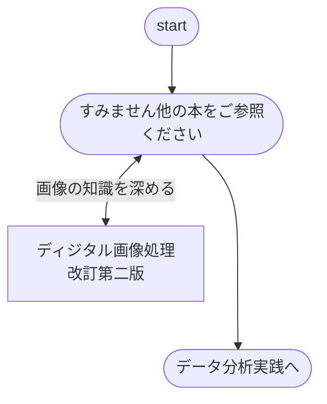
```mermaid
flowchart TD
    id0([start]) --> id1([すみません他の本をご参照ください])
    id1 <-- 画像の知識を深める --> id2[ディジタル画像処理<br/>改訂第二版]
    id1 ---> id3([データ分析実践へ])
```


|書名|概要|
|:--|:--|
|[ディジタル画像処理 改訂第二版](https://amzn.to/3rX2wOe)<br/><a href="https://amzn.to/3rX2wOe" target="_blank"></a>|<ul><li/>本書すげぇ。「画像処理エンジニア検定エキスパート対応」という資格用テキストらしいのですが、この手の本にありがちな、大家の名前＋弟子が走り書きで内容がない、ではなく、ディジタル画像についてありとあらゆる（と素人の私は思った）内容が掲載されている。<li/>カメラレンズの構造やRGB、画像変換や行列、機械学習まで。画像データは一切扱わない、という人ならともかく、そうでない人ならば読んでおくと差がつくでしょう。</ul>|


## 2.5.5. 地理空間の1冊
- 例えば緯度経度は単なる数値として扱えてしまうけれど、国レベルのデータであればx-y平面ではなく球面（地球規模ならば平たく潰れた球）であることを計算に加味する必要がある
- 狭い範囲でも近接した地域の効果により空間ラグなどを考慮する必要があり、地理空間は独特の扱いが必要
- この分野はRの本が多いですが徐々にPython本も出てきている模様。
- 『空間統計学 自然科学から人文社会科学まで』も重要な本ですが、100冊からは削除。

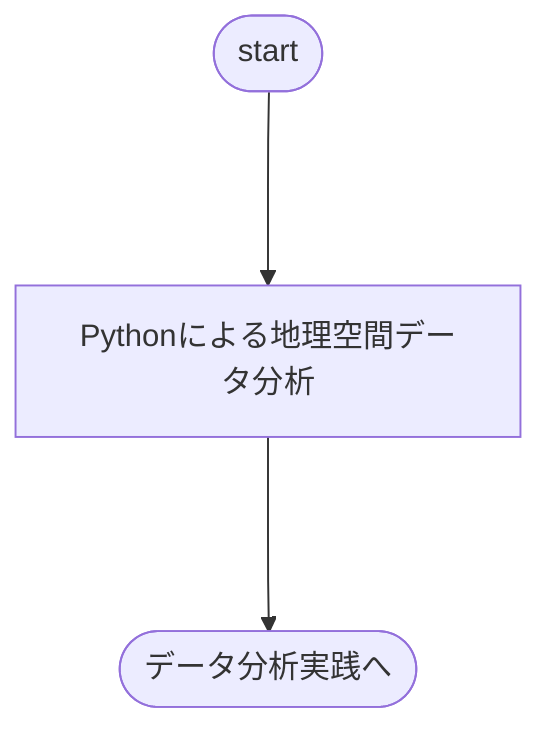
```mermaid
flowchart TD
    id0([start]) ---> id1[Pythonによる地理空間データ分析]
    id1 ---> id3([データ分析実践へ])
```

|書名|概要|
|:--|:--|
|[Pythonによる地理空間データ分析](https://amzn.to/4cwSwgi)<br/><a href="https://amzn.to/4cwSwgi" target="_blank"></a>|<ul><li/>Pythonではまだ類書が少なく貴重な１冊<li/>豊富なPythonコード例にて地理空間データの取り扱いについて一通り実行しながら学べます<ul><li/>QGIS(地理情報データを扱うシステムGISのオープンソース版<li/>GoogleEarthEngine<li/>OpenStreetMap（GoogleEarthは商用利用で要ライセンスなので、商用利用もフリーなツール）<li/>GeoPandas(Pandasの地理空間版)</ul></ul>|


## 2.6. 機械学習周辺の手法4冊（実験計画法の1冊、数理最適化の2冊、意思決定の数理の1冊）
- データ分析の範囲というかとするとちょと微妙というか範囲外ではありますが、持ち込まれた分析テーマが機械学習なのか実験計画法が適しているのか、数理最適化なのか、その他の数理手法なのかは最低限、見極めた方が良いと思うので、最低限のところを
- 実験計画法
    - Wikipediaによると下記の通りで、データがあり機械学習アルゴリズムでということではなく、色々な条件があり最適解を……、などというときに効果的かと思います。
        >実験計画法は、効率のよい実験方法を設計し、結果を適切に解析することを目的とする統計学の応用分野である。
    - AIで解決したい、と要望が来てもルールベースだったり実験計画法で解くべきテーマというのがあります。それを見極めるためにも基礎的なところは押さえておきたいです。
- 数理最適化
    - 機械学習は誤差の最小化の意味での最適化ですが、売り上げ最大化とか、コスト最小化とか機械学習を用いずに最適化を求める分野がある。きちんと押さえておきたい
- 意思決定の数理
    - ビジネスは意思決定の場なのだから機械学習をビジネス適用するのであれば意思決定に役立つテーマ設定が必要という話を冒頭でしました
    - 逆にいうと意思決定に役立てば機械学習でなくともよい＆機械学習ではできず他の数理手法の方が適している場合がある
    - 数理最適化もそうなのだがそれよりもっと広く、微分方程式モデル、ゲーム理論、オペレーションズリサーチ、等々


```mermaid
flowchart TD
    id0([start]) --->id1[Pythonで学ぶ<br/>実験計画法入門<br/>ベイズ最適化による<br/>データ解析]
    subgraph sub1 [実験計画法]
        id1
    end
    id1 --> id9([データ分析実践へ])

    id0 -->id2[Pythonではじめる<br/>数理最適化<br/>ケーススタディで<br/>モデリングの<br/>スキルを身につけよう]
    subgraph sub2 [数理最適化]
        id2 -- 理論を深める --> id3[最適化手法入門]
    end
    id3 --> id9

    id0 --> id4[Python意思決定<br/>の数理入門]
    subgraph sub3 [意思決定の数理]
        id4
    end
    id4 --> id9

```


|書名|概要|
|:--|:--|
|[Ｐｙｔｈｏｎで学ぶ実験計画法入門　ベイズ最適化によるデータ解析](https://amzn.to/3QvHMHC)<br/><a href="https://amzn.to/3QvHMHC" target="_blank"></a>|<ul><li/>下記のような内容で、Pythonコード例月で学べます<blockquote>第1章　データ解析や機械学習を活用した分子設計・材料設計・プロセス設計・プロセス管理<br/>第2章　実験計画法<br/>第3章　データ解析や回帰分析の手法<br/>第4章　モデルの適用範囲<br/>第5章　実験計画法・適応的実験計画法の実践<br/>第6章　応用事例<br/>第7章　さらなる深みを目指すために<br/>第8章　数学の基礎・Anaconda・Spyder</blockquote></ul>|
|要注意第２版が出ています[Pythonではじめる数理最適化(第2版): ケーススタディでモデリングのスキルを身につけよう](https://amzn.to/3yIEqKK)<br/><br/>[Pythonではじめる数理最適化 ―ケーススタディでモデリングのスキルを身につけよう―](https://amzn.to/45jnlBE)<br/><a href="https://amzn.to/45jnlBE" target="_blank"></a>|<ul><li/>私は未読ですが第2版が出ています。<li/>機械学習とはちょっと範囲外ですが数理最適化もビジネスでよく使われるので最近類書も増えてきました。ただ、なんのためにそれをやっているのかが掴みにくいところがあり、具体例とコード例の豊富な本書を選びました<li/>前半は、連立一次方程式や線形計画法の簡単な例で数理最適化の基礎とPythonコード例を学びます。<li/>後半はビジネスに近い例を解いていきます。<blockquote>第Ⅰ部　数理最適化チュートリアル<br/>第1章　数理モデルとは<br/>第2章　Python数理最適化チュートリアル<br/>第Ⅱ部　数理最適化のケーススタディ<br/>第3章 学校のクラス編成<br/>第4章 割引クーポンキャンペーンの最適化<br/>第5章　輸送車両の配送計画<br/>第6章　数理最適化APIとWebアプリケーションの開発<br/>第7章　商品推薦のための興味のスコアリング</blockquote></ul>|
|[最適化手法入門](https://amzn.to/3qp6fUj)<br/><a href="https://amzn.to/3qp6fUj" target="_blank"></a>|<ul><li/>数理最適化も昔から研究されている分野ですので良書がたくさんありますが、東大のOCWでも使われているということとPythonコード例ありとのことで本書を選びました</ul>|
|[Python意思決定の数理入門](https://amzn.to/3qlzmYN)<br/><a href="https://amzn.to/3qlzmYN" target="_blank"></a>|<ul><li/>数理最適化の項でも申し上げましたが、求められている分析テーマが機械学習にハマるものと異なるものがあります。その場合に「わからない」ではなく、調べるための当たりをつけるために広く薄く知っておくというのが私のモットーなため、こういう広く浅い本を多めに読んでいます<li/>Amazon書評で「実用的ではない」と低評価の方がいますがわかっちゃいない。「意思決定の数理」なんて広い分野を1冊でビジネスレベルに持ってけるわけがない。あくまでも自分のテーマに近いのがどの分野かと、次に学習を深めるためのガイドブックでしかなく、逆にそういうガイドブックを求めるための方の1冊<blockquote>第1章　はじめに<br/>第2章　戦略の微分方程式モデル<br/>第3章　基礎的な意思決定の数理的扱い<br/>第4章　ゲーム理論の基礎<br/>第5章　意思決定のための OR の基礎<br/>第6章　組合せ最適化による意思決定<br/>第7章　マルチエージェントベースモデリングによる意思決定<br/>第8章　強化学習による意思決定<br/>第9章　不確定性を含むゲームでの意思決定<br/>第10章　集団の意思決定<br/>第11章　意思決定とメカニズム・デザインの視点</ul>|


## 2.7. 数学的基礎(微積・線形代数・集合と位相）の4冊
- 大学１年生レベルの微分積分と線形代数からスタートという世界。そこあたりは多数類書が出ているので、書店で体に合ったものを（内容だけでなくて装丁や重さ、紙/電子書籍もあると思う）
    - 苦手という人はまずは高校レベルの参考書から
    - よろしければご参照を [データ分析の数学学習に疲れ「数学大嫌い」というあなたを癒やすお友達あるいは悪魔](https://qiita.com/aokikenichi/items/91a90952f0f9e47e90aa)

```mermaid
flowchart TD
    id0{"『統計学のための数学入門30講』<br/>が厳しい"}
    id0 -->|めっちゃ厳しい|id1([高校レベル<br/>の参考書]) 
    id1 --> id2
    id0 -->|厳しい|id2([大学一年生レベルの<br/>微積と線形代数])
    id0 -->|線形代数って？|id5[プログラミング<br/>のための線形代数]

    id0 -->|何とかなる|id3{目的により}
    id3 -->|機械学習アルゴリズムの根幹である<br/>最適化を深める|id6[これなら分かる最適化数学]
    id6 -->|最適化について理解を深める|id7[スタンフォード ベクトル行列<br/>からはじめる最適化数学]
    id3 -->|より高度な数学の入り口<br/>「集合」や「位相」へ|id8[集合と位相をなぜ学ぶのか]

    id7 --> id9([機械学習の本へ])
    id8 --> id9
```

|書名|概要|
|:--|:--|
|[これなら分かる最適化数学](https://amzn.to/3s4cPjz)<br/><a href="https://amzn.to/3s4cPjz" target="_blank"></a>|<ul><li/>機械学習でも用いられる最適化に必要な（もののみの）微分積分、線形代数の解説。好著中の好著と思いますが、紹介されることが少ないので、これで差が付きます！<li/>機械学習・深層学習のための数学、と題した本が出ていますが内容は微分積分と線形代数の普通のテキストをかいつまんで式の羅列のみって残念な本が多い。機械学習は結局は、モデルを作る→正解との誤差を最小化する≒最適化！、なのでここに特化した本書が一番核心をついて分かりやすいと思います。<li/>コンセプトは上記書「統計学の~」に似ているが本書は、より目的の最適化に特化しており、例題を解いていくと定着するようになっている。<li/>「最適化」という言葉がごっちゃでわかりにくいですが、機械学習は誤差を最小にする最適化、数理最適化はコストを最小にするなどの最適化となりどちらも「最適化」が必要です</ul>|
|[プログラミングのための線形代数](https://amzn.to/43X10sN)<br/><a href="https://amzn.to/43X10sN" target="_blank"></a>|<ul><li/>微分積分は、傾きを求める、細かく分けて足し合わせる、ってなんとなく意味がわかるけれど線形代数って一体なんなんだ？<li/>線形代数の「意味」が分かる<li/>行列は写像だ！</ul>|
|[スタンフォード ベクトル・行列からはじめる最適化数学](https://amzn.to/47lDp88)<br/><a href="https://amzn.to/47lDp88" target="_blank"></a>|<ul><li/>『これなら分かる最適化数学』で基礎は身につくのですがよほど頭が良くないと体に染み付いていません<li/>本書ではこれでもか！というほどの演習で体に染み付けます<li/>残念ながら解答がないのですが私が勉強中で公開していますよ [『スタンフォード ベクトル・行列からはじめる最適化数学』1章章末問題の解答](https://qiita.com/aokikenichi/items/f67d1681e7faa29cc5af)</ul>|
|[「集合と位相」をなぜ学ぶのか](https://amzn.to/3QsMKF1)<br/><a href="https://amzn.to/3QsMKF1" target="_blank"></a>|<ul><li/>微積と線形代数は手を動かす労力を惜しまなければなんとかなると思う。でも集合と位相は「そもそも何をやっているのか？」が全くわからなくなる<li/>最初から読まなくてもよいと思う。以降で紹介する本のなかで、〇〇集合、位相〇〇などの沼にはまりかけたら本書を読むといいと思う。完全解決するわけではないが、ちゃんと意味があってそういった概念が導入されていることは分かる。私も泥んこになりながら格闘中なので大きなことは言えないが、統計学がセクシーな学問とするのであれば、集合・位相をマスターすることが、下記の分かれ目と思っている。<ul><li/>一発屋のグラビアアイドルで終わるのか、女性にも一目置かれる素敵な女優になれるのか<li/>一発屋のアイドル歌手で終わるのか、男性にも一目置かれる素敵な俳優になれるのか<li/>人工知能に使われるデータ処理屋で終わるのか、人工知能にも一目置かれる素敵な課題設定者になれるのか</ul></ul>|


## 2.8. プログラミングの3冊
- プログラマなら言わずもがなな面もありますが、私はRからデータ分析に入ったこともありあえて挙げてみました。
- オープンソースのAutoMLであるPyCaretについても、プログラミング≒コーディングによる分析環境との位置付けでここに入れます。

```mermaid
flowchart TD
    id0{{Python機械学習プログラミング<}}
    id0 <-- 手っ取り早く<br/>機械学習アルゴリズム<br/>を手に慣らす --> id2[Python 実践AIモデル<br/>構築100本ノック]
    id0 <-- AutoMLで試す --> id4[PyCaretで学ぶ<br/>機械学習入門]
    id0 <-- 通常のアルゴリズム<br/>をマスターする --> id3[Pythonで学ぶ<br/>アルゴリズムと<br/>データ構造]

    id00{{改訂新版 前処理大全}} <-- 通常のアルゴリズムをマスターする --> id3
```


|書名|概要|
|:--|:--|
|[Python 実践AIモデル構築 100本ノック](https://amzn.to/456SXLi)<br/><a href="https://amzn.to/456SXLi" target="_blank"></a>|<ul><li/>100本ノックシリーズは多数出ており、100個の課題がありそれをPythonで解いていくものです。<li/>本書は分析手法ごとに1つずつ課題を解いていくので、頭の整理にも良いかなと思います。<li/>『［第3版］Python機械学習プログラミング 達人データサイエンティストによる理論と実践』を実践すればそちらでも良いかなと思いますが、こちらの方は手っ取り早く復習という感じですかね。</ul>|
|[PyCaretで学ぶ 機械学習入門](https://amzn.to/3WJPPlp)<br/><a href="https://amzn.to/3WJPPlp" target="_blank"></a>|<ul><li/><font color="blue">new</font>新規追加<li/>オープンソースのAutoMLであるPyCaretのチュートリアル的解説書です。<li/>下記目次のとおりPyCaretでは前処理からデプロイまでが可能です。<blockquote>CHAPTER 01　Pycaretとは<br/>CHAPTER 02　環境構築<br/>CHAPTER 03　機械学習の流れ<br/>CHAPTER 04　教師あり学習　回帰分析<br/>CHAPTER 05　教師あり学習　分類<br/>CHAPTER 06　教師なし学習　クラスタリング<br/>CHAPTER 07　データの前処理<br/>CHAPTER 08　モデルチューニング<br/>CHAPTER 09　評価指標<br/>CHAPTER 10　デプロイ</blockquote><li/>商用のAutoMLツールと比べると非力ではありますが、知るコストに比べ得られるものが多い選択肢の１つかなと思います。</ul>|
|[Ｐｙｔｈｏｎで学ぶアルゴリズムとデータ構造 データサイエンス入門シリーズ](https://amzn.to/43ZJ1C0)<br/><a href="https://amzn.to/43ZJ1C0" target="_blank"></a>|<ul><li/>機械学習ではないアルゴリズムの本です。<li/>機械学習と言っても教科書データのように綺麗なデータばかりではなく、通常のアルゴリズムを用いてデータ加工や探索が必要な場合があります。基本的なアルゴリズムは押さえておくと便利だと思います。</ul>|

## 3. データ管理の3冊
- テーマが決まったとして、往々にしてあるのが、下記です。
    - データがない
    - データはあるが担当者が独自に加工したExcel等で分析に耐えうるようなものではない
    - IDが統一されてなくて紐付けできない
    - A部署に依頼すれば入手できるが、何に使うのか明示しないと入手できない
- こうならないためにどうするか、こうなっていたらどうしたら良いかが2番目のハードルです。
- 大規模データを取り扱うことも増えてきたと思います。Apache Spark本を追加しました。

```mermaid
flowchart TD
    id0{{データマネジメント大全}} -->id1{目的により}
    id1 -->|データマネジメントの戦略について|id2[世界標準のデータ戦略完全ガイド]
    id1 -->|データ管理のための基盤のもう少し具体論|id3[実践的データ基盤への処方箋]
    id3 -->|大規模データ管理|id4[Apache Spark徹底入門]
```

|書名|概要|
|:--|:--|
|[実践的データ基盤への処方箋](https://amzn.to/45hjdmh)<br/><a href="https://amzn.to/45hjdmh" target="_blank"></a>|<ul><li/>いざデータ分析をしようとすると、「あると思っていたデータがない」、「精度を上げるためには〇〇のデータが必要だが他部署に依頼する必要・渋られる」、「ID連携が部署館でなされていない」等々社内データが「使える」状態になっていないことが噴出します。<li/>Amazon紹介ページにあるように、社内データを社内で「使える」状態にするためのノウハウを解説した本です。<blockquote>「会社内でバラバラになっているデータを集めたが、これから何をしていいか分からない」<br/>「最新技術を利用してデータ基盤をつくったがニーズがなかった」<br/>「頻繁に障害が発生するデータ収集に対応してきたが、そのデータは誰にも利用されていなかった」<br/>「データの意味が分からず、データの意味の聞き込み調査で1日が終わった」<br/>(中略)<br/>そこで本書では、データ基盤の本来の機能を甦らせるため、またデータ基盤の構築でつまづかないためノウハウを処方します。データ整備、システムの知識、組織のあり方、データの取り扱いといった"データ基盤を機能させるためのノウハウ"を、この道のプロが惜しげもなく披露します。データ基盤が思うように機能していない、これからデータ基盤を構築したいが何からはじめればよいか分からない、といったことで悩まれている方には一読の価値があるはずです。</blockquote></ul>|
|[世界標準のデータ戦略完全ガイド データセンスを磨く事例から、データの種類と仕組み、戦略策定のステップまで](https://amzn.to/3Qyn7Tr)<br/><a href="https://amzn.to/3Qyn7Tr" target="_blank"></a>|<ul><li/>データ分析を含んでデータ活用についての戦略をどう立てどう実行するかのノウハウの本です。<li/>Amazon紹介ページにはこう紹介されています。<blockquote>データ戦略の目的は主に6つあります。<br/>1）意思決定プロセスを改善する<br/>2）顧客（市場）を理解する<br/>3）より優れたサービスを生み出す<br/>4）より優れた製品を生み出す<br/>5）業務プロセスを改善する<br/>6）データを収益化する<br/>（中略）<br/>AI（機械学習など）の仕組みや、インサイトの見いだし方、データインフラの整備、データ能力の高い組織のつくり方までしっかりフォロー。</blockquote><li/>巻末付録のテンプレートをもとに自社の状況を書き下してみると良いと思います。著者記事青木は別のテンプレートで実施していますが、「あ、ここの共通理解が得られてないな」と早めに気づいて対処することが肝心です。</ul>|
|[Apache Spark徹底入門](https://amzn.to/4fQQhHi)<br/><a href="https://amzn.to/4fQQhHi" target="_blank"></a>|<ul><li/><font color="blue">new</font><li/>本書はDatabricksのエンジン部分というか、Apache Sparkを使いやすくまとめたのがDatabricksで、あり本記事著者青木が触れていたというところもあり。<li/>大規模データを扱うにはいろいろAzureやAWS、Google系はそれぞれみんなお気に入りがあるっしょ、ただそういうのに馴染みがなく大規模データの取り扱いで知りたいという方には、ま、Sparkならそんな間違いないっしょというところで挙げました。</ul>|

# 4. PJ全体・その他
## 4.1. 構築・運用の２冊
- というわけでここまでマスターするとそれなりの結果が出てきていると思いますが、運用となるとまたハードルがあります
- どう構築したら良いのか、検証ではそれなりの精度だったモデルが精度が悪化していないか等、がんばろうぜ

```mermaid
flowchart TD
    id0([一通り機械学習アルゴリズムを終了]) -- AIシステム構築の型 --> id1[AIエンジニアのための<br/>機械学習システムデザインパターン]
    id1 -- 特に深層学習PJの実装 --> id2[ディープラーニング実践ガイド]
    id1 ---> id3([他の機械学習の本あるいはデータ分析実践へ])
    id2 ---> id3
```

|書名|概要|
|:--|:--|
|[AIエンジニアのための機械学習システムデザインパターン](https://amzn.to/3QroLWC)<br/><a href="https://amzn.to/3QroLWC" target="_blank"></a>|<ul><li/>では実装となった時にどういうノウハウが必要か。構築・運用について。<li/>本記事著者青木はこの項あまり実績がありません。最低限のところは知っておこうと学んだ程度です。<li/>Amazon紹介ページにある通り、機械学習の実装のためのデザインパターンを解説したものです。<blockquote>【本書のゴール】<br/>・機械学習を実用化する方法が学べる<br/>・Pythonによる機械学習ワークフローおよびWebアプリケーション開発の概要を学べる<br/>・機械学習を組み込んだシステムの運用ノウハウを得られる<br/>・機械学習システムのトラブルシューティングや調査方法を学べる</blockquote></ul>|
|[ディープラーニング実践ガイド](https://amzn.to/45rmBuE)<br/><a href="" target="_blank"></a>|<ul><li/>深層学習を用いたアプリ開発や運用の実践例やノウハウ集<li/>TensorFlowベース</ul>|

## 4.2. 資格の2冊
- 資格は必ずしも必要ではないかなと思います。ただ触れておいた方が良いかなの観点として、
    - その分野のスタンダードな知識体系を知ることができる。
        - 特にベンダー特定の分析環境を使っていると視野が狭まりがちなので。
    - PJのGo/Stopや、採用・転職を考えるなら採否の判断をする人は必ずしも専門家でないので資格が生きることが多い。
        - でも資格に寄りかかってはダメだよ。

```mermaid
flowchart TD
    id0([start]) -- G検定を受けるにはもちろん<br/>合格者が多いので<br/>話を合わせるためにも -->id1[深層学習教科書 ディープラーニング<br/>G検定ジェネラリスト公式テキスト 第3版]
    id0 -- 統計検定準1級を受ける<br/>にはもちろんデータ分析の<br/>概念の総整理にも --> id2(日本統計学会公式認定<br/>統計検定準1級対応<br/>統計学実践ワークブック)
```

|書名|概要|
|:--|:--|
|[深層学習教科書 ディープラーニング G検定(ジェネラリスト)公式テキスト 第3版](https://amzn.to/3Agzygi)<br/><a href="https://amzn.to/3Agzygi" target="_blank"></a>|<ul><li/><font color="red">update</font>新しい版<li/>G検定がDS関連の資格で一番広まっているのかな。持っている人が多いので話を合わせるためにも読んでおいて損はないかなと思います。<li/>データ分析を専門にしている人でも自分の担当については詳しくなりますが、世の中一般ではここが問われているんだと知ることも必要かなと思います。新案件がどこからくるかわからないので。<li/>本記事著者青木もようやく受け、合格しました！</ul>|
|[日本統計学会公式認定 統計検定準1級対応 統計学実践ワークブック](https://amzn.to/3DMgTra)<br/><a href="https://amzn.to/3DMgTra" target="_blank"></a>|<ul><li/>統計検定のテキストは要点の羅列で、教える気あんのかゴラァって感じだったのが、本気出したらやればできるじゃんって感じ。統計検定１級よりも広い範囲ではないかと言われる統計検定準１級向けのテキストかつ問題集なのですが、東大出版会統計学入門赤本より広い範囲（一部機械学習的な分野も含む）で、データ分析するための基礎として「こういうところを知ってなきゃだめだよ」という目安としては非常に良いのではないか。<li/>広範囲を１冊にしているため各項目の解説は要点のみとはなりますが、以前のテキストの羅列とは異なり、丁寧であり、章末問題で理解を確かめられます。いきなり本書をテキストとして学ぶのは無茶ですが、いろいろテキストで学んだ後に総整理や、漏れている項目の補強などに役立つと思います。<li/>必ずしも必須ではないですがこれだけ知っておくと強みになりますね。<li/>（注）本記事著者青木はまだ受けてないっす</ul>|

## 4.3. KAGGLEの3冊
- 特に絶対必要というわけではないですが、案件が少ない方とか、簡単な案件の方とかは筋トレの要領で受けるのも良いのかも。そして特に特徴量エンジニアリングとか鬼ほど鍛えられますからね。
- 私は入門のをちょろっとしかしたことないのであまり言えません。むしろここら辺の書籍で精度向上のノウハウを学ぶのがメインです。
- [The Kaggle Book：データ分析競技 実践ガイド＆精鋭31人インタビュー (impress top gear)](https://amzn.to/3YP4azH)は必読だと思うのですが読んでないので挙げず。
    - いえね、英語版買ってしまって積読のまますまん。

```mermaid
flowchart TD
    id0{{『Python機械学習プログラミング』など}} -- 取り合えずKaggleを始めたい --> id1[実践Data Scienceシリーズ<br/>PythonではじめるKaggleスタートブック]
    id1 ---> id4([Kaggle])
    id4 <-- 精度をあげる --> id2[Kaggle Grandmasterに学ぶ<br/>機械学習 実践アプローチ]
    id4 <-- 精度をあげる --> id5([Kaggleで勝つデータ分析の技術])
    id4 <-- 画像や自然言語の問題なら -->id3[Kaggleに挑む<br/>深層学習プログラミングの極意]
```

|書名|概要|
|:--|:--|
|[実践Data Scienceシリーズ PythonではじめるKaggleスタートブック](https://amzn.to/3YxybCf)<br/><a href="https://amzn.to/3YxybCf" target="_blank"></a>|<ul><li/>前述『Kaggleで勝つデータ分析の技術』の弟分的位置づけ。代表的なコンペティションであるKaggleに勝つというよりもまず始めてみましょうという導入本。<li/>類似の本に『データサイエンスの森　Kaggleの歩き方』がありますが、Kaggle自体の紹介が主で分析入門の記載は少なく、本書を読めばこちらの本は不要かと。</ul>|
|[Kaggle Grandmasterに学ぶ 機械学習 実践アプローチ](https://amzn.to/3OrusS0)<br/><a href="https://amzn.to/3OrusS0" target="_blank"></a>|<ul><li/>私が読んだのは洋書版(英語は弱いのですが大部分コード例なので問題ないと思って)<li/>大部分はPythonコード例。<li/>『Kaggleで勝つデータ分析の技術』とほぼ同レベルで、本書はコード例メイン。<li/>Kaggleに特化というよりも実際のデータ分析に役立つTips集といった感じ。</ul>|
|[Kaggleに挑む深層学習プログラミングの極意](https://amzn.to/3YpzjaF)<br/><a href="https://amzn.to/3YpzjaF" target="_blank"></a>|<ul><li/>テーブルデータではなく、画像分類・検索と自然言語処理中心の本<li/>画像分類や自然言語処理を行う必要が出た場合、テキスト例は「きれいな」分かりやすいデータばかりなので、Kaggleのむずいデータに取り組むと役立つと思う、その準備運動として</ul>|

# 5. Next!のX5冊
- ディープラーニングってなると全部そちらになびくのが嫌い
- 進化的アルゴリズム
    - 遺伝的アルゴリズムではなく広く「進化的」な動きをするアルゴリズム
    - Sakana AI [sakana.ai/blog](https://sakana.ai/blog/) の言語モデルを進化的アルゴリズムでマージして大規模にしようというので話題になりましたね。遺伝的アルゴリズムをはじめ進化的アルゴリズムは古くからあるのですが、世の中はディープラーニング！となったら全員がそっちに行ってしまうので、ひっそりとした進化的アルゴリズムを学ぶなら今！


|書名|概要|
|:--|:--|
|[Pythonではじめるオープンエンドな進化的アルゴリズム](https://amzn.to/4fGcPum)<br/><a href="https://amzn.to/4fGcPum" target="_blank"></a>|<ul><li/><font color="blue">new</font>新規追加<li/>遺伝的アルゴリズムを初めて知った時はすごいなと思ったもののその後表舞台に出ているのをほとんど見ず。和書もほとんど新しいのがなかったですよね。<li/>遺伝的アルゴリズム自体も「進化」していて生物進化を模したアルゴリズムは進化的アルゴリズムと呼ばれるらしい。<li/>Sakana AIさんが小規模LLMを進化的アルゴリズムで大きなLLMに作成するというので話題になりましたが、この考え方は有望かなと思うので、挙げました。</ul>|
|[Human-in-the-Loop機械学習](https://amzn.to/3SXVrYw)<br/><a href="https://amzn.to/3SXVrYw" target="_blank"></a>|<ul><li/><font color="blue">new</font>新規追加<li/>これはNext技術というよりも泥臭い話。<li/>最初"Human-in-the-Loop"という言葉を知った時「どういう夢技術だろう」と思ったけれど、実際は「AIでの全自動は無理だからLoopの中に人を入れて」という泥な話だった。<li/>本書ではそのうち、学習データ作成のアノテーションの話がメイン。<li/>ひたすら正解をつけるだけじゃなくて、間違いやすいデータ、半自動化などいろいろテクニカルな話がある。</ul>|
|[Federated Learning: プライバシー保護下における機械学習](https://amzn.to/4g0FZVa)<br/><a href="https://amzn.to/4g0FZVa" target="_blank"></a>|<ul><li/><font color="blue">new</font>新規追加<li/>連合学習について唯一？の和書。<li/>連合学習とは、分散しているデータを1つにまとめないで分散したまま学習して結果を得るもの。<li/>分散処理でリソースを有効活用の面もありますが、主には外に出せないデータをそのまま学習させて学習結果のみを得る、そして元のデータの秘匿性は侵さないみたいな技術。<li/>個人や企業の秘匿情報を侵さずに扱えるのでこれからは必須の技術と思います。</ul>|
|[量子技術入門](https://amzn.to/4728CNJ)<br/><a href="https://amzn.to/4728CNJ" target="_blank"></a>|<ul><li/><font color="blue">new</font>新規追加<li/>Nextというよりもうバズりに入っているのだろうか。でもエンジニア的に考えると完全にNextですよね<li/>量子コンピューター本は多量にありますが、量子力学と量子情報科学、そしてそれらをエンジニアリングする量子技術は違っていて、そこをまとめて解説しようという本。<li/>むずくてまだ全然理解できていないですが、ここを目指したいなという意味で挙げてます。</ul>|
|[リザバーコンピューティング:時系列パターン認識のための高速機械学習の理論とハードウェア](https://amzn.to/3WWRxQO)<br/><a href="https://amzn.to/3WWRxQO" target="_blank"></a>|<ul><li/><font color="blue">new</font>新規追加<li/>まさにNext!深層学習は計算コストがネックだが、同等の複雑な問題が解けて計算量を減らすという夢の技術であるリザバーコンピューティング。<li/>水瓶水たまりみたいのが「リザバー」で、そこにデータという小石を投げると波紋が広がるじゃないですか。データのパターンにより波紋が変わり、その波紋を線形学習器で読み取ってしまう。線形学習器だから計算コストがかからないというもの。線形で複雑な問題が解けるかは「波紋」のところの妙味らしい。<li/>この技術が有望なのかどうかは正直わかりません。ただ眠っていたニューラルネットワークがここまで隆盛したし、深層学習の計算量ネックはずっとついて回るし、新しいもの好きであれば読んでおいて良いかも。<li/>Pythonコードつき</ul>|


---

<!--
ダダ漏れ　作成中メモ

# 入れたいが分野どうしよう

- 機械学習による検索ランキング改善ガイド
- インフォグラフィック制作ガイド 「関係」を可視化する情報デザインの手引き

# TEMP
## 生成AI
OpenAI GPT-4/ChatGPT/LangChain 人工知能プログラミング実践入門
生成AIプロンプトエンジニアリング入門
深層学習　生成AIの基礎
ChatGPT　大規模言語モデルの進化と応用
LLMのファインチューニングとRAG: チャットボット開発による実践

## ゲーム理論
ゲーム理論からの社会ネットワーク分析
活かすゲーム理論
Rで学ぶゲーム理論

## etc
ベイズ分析の理論と応用: R言語による経済データの分析
最適輸送の理論とアルゴリズム

SQLではじめるデータ分析 クエリで行う前処理、時系列解析、コホート分析、テキスト分析、異常検知

データ解析のための数理統計入門
空間回帰モデル 計量分析one point
データ分析に必須の知識・考え方 認知バイアス入門

実験計画法―過飽和計画の構成とデータ解析―
The Kaggle Workbook 著名コンテストに学ぶ！競技トップレベルの思考と技術［機械学習・深層学習の実例と練習問題］
日本統計学会公式認定 統計検定 準1級 公式問題集
エンジニアのためのドキュメントライティング
データ と デザイン


ヤバい統計
組織を変える5つの対話
グラフニューラルネットワーク (機械学習プロフェッショナルシリーズ)
GitLabに学ぶ 世界最先端のリモート組織のつくりかた


# R
Rユーザのためのtidymodels実践入門〜モダンな統計・機械学習モデリングの世界

---
# 2024 Next Break
The Kaggle Book：データ分析競技 実践ガイド＆精鋭30人インタビュー
Pythonで学ぶネットワーク分析
DXを成功に導くデータマネジメント データ資産価値向上と問題解決のための実務プロセス75
データサイエンティストのための特徴量エンジニアリング
Pythonデータサイエンスハンドブック 第2版
現場のプロがわかりやすく教える位置情報エンジニア養成講座
ChatGPT GPTsが作れるようになる本
生成AIスキルとしての言語学

---


# 却下
## 難易度高、専門すぎる
神経回路網の数理
機械学習のための確率過程入門: 確率微分方程式からベイズモデル,拡散モデルまで
拡散モデル データ生成技術の数理

# 業務分野にて
エンジニアが学ぶ金融システムの「知識」と「技術」 第2版
戦略ごっこ―マーケティング以前の問題
エビデンス・ベースド・マーケティング
地理学で読み解く流通と消費: コンビニはなぜ集中出店するのか
金融AI成功パターン
THE MODEL
企業価値向上のための 経営指標大全
一般気象学 第2版補訂版
Pythonによる気象・気候データ解析Ⅰ―Pythonの基礎・気候値と偏差・回帰相関分析―
Pythonによる気象・気候データ解析Ⅱ―スペクトル解析・EOFとSVD・統計検定と推定―
Pythonで学ぶ衛星データ解析基礎
現代マーケティング・リサーチ〔新版〕
AIは短歌をどう詠むか
次世代の実証経済学
データサイエンスの経済学: 調査・実験,因果推論・機械学習が拓く行動経済学
多数派の専横を防ぐ　意思決定理論とEBPM
傾向スコア
ＥＢＰＭ エビデンスに基づく政策立案の導入と実践

## 古い
ディープラーニングによる自然言語処理

-->
